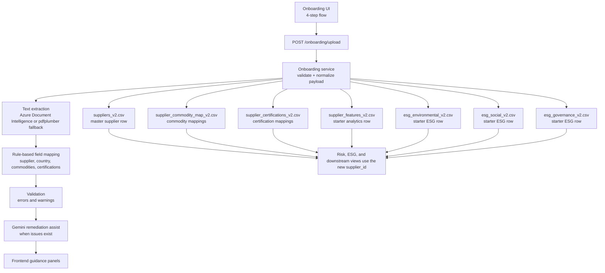

# Supplier AI System

This project is an AI-driven Supplier Intelligence application with a FastAPI backend and a React frontend. It is now structured as a broader supplier intelligence workspace built on top of the existing `v2` CSV datasets, with executive reporting, supplier engagement workflows, due diligence support, risk scoring, and advisor capabilities.

## Current Stack
- Backend: FastAPI
- Frontend: React + Vite + TypeScript + Tailwind
- Data source: CSV datasets in `data/`
- AI integrations:
  - Azure Document Intelligence for document OCR/extraction
  - Gemini using `gemini-3.1-flash-lite-preview` for onboarding assist and advisor flows

## Active Application Modules
- Executive Dashboard
- Simulator
- Analytics
- Supplier Engagement
- Due Diligence Agent
- Supplier Advisor AI

## Current Product Architecture

### Frontend page structure
The frontend navigation is now organized into 5 primary pages:
- `Executive Dashboard`
- `Simulator`
- `Analytics`
- `Supplier Engagement`
- `Due Diligence Agent`

This structure separates leadership summary views from workflow-heavy operational modules:
- `Executive Dashboard`
  - high-level KPIs
  - high-level visual risk summaries
  - supplier geography view
  - supplier watchlist
- `Simulator`
  - reserved for scenario and what-if modeling
  - currently scaffolded as the next planning surface
- `Analytics`
  - reserved for deeper breakdowns and detailed chart analysis
  - intended home for richer country, segmentation, and trend analysis
- `Supplier Engagement`
  - operational workspace
  - currently houses onboarding, auditing, and traceability flows
- `Due Diligence Agent`
  - focused supplier-level AI review surface

### Backend architecture
The backend is currently organized around service-layer aggregation and workflow routers:
- `analytics`
  - overview metrics
  - executive dashboard aggregation
- `risk`
  - supplier risk scoring
  - risk overview and supplier-level monitoring outputs
  - due diligence support
- `onboarding`
  - supplier intake and persistence
- `auditing`
  - audit queue, review, and AI audit insights
- `traceability`
  - commodity/country/certification trace workspace
- `advisor`
  - conversational supplier copilot support

## Executive Dashboard
The Executive Dashboard is the new high-level leadership view. It intentionally combines the most important parts of the older overview and risk pages while avoiding detailed analyst breakdowns.

### Frontend
The Executive Dashboard currently includes:
- headline KPI cards
  - total suppliers
  - high risk suppliers
  - average overall risk
  - average operational risk
  - average ESG risk
  - expiring or expired certifications
- 3 separate risk donuts
  - operational risk donut
  - ESG risk donut
  - overall risk donut
- supplier geography map
  - rendered using `react-simple-maps`
  - shows supplier spread by country
  - marker size reflects supplier concentration
  - map tooltip shows:
    - country name
    - count of suppliers
- certification health visual
  - valid
  - expiring soon
  - expired
- commodity exposure chart
  - supplier concentration across key commodity groups
- country exposure bar chart
  - top countries by supplier concentration
  - darker-to-lighter bar gradient by ranking
- suppliers requiring review

### Backend
The Executive Dashboard is backed by a dedicated aggregated endpoint:
- `GET /analytics/executive-dashboard`

The aggregation currently prepares:
- executive KPIs
- overall risk mix
- operational risk mix
- ESG risk mix
- certification health counts
- country-level geographic exposure
- commodity-level supplier exposure
- top suppliers requiring review
- chart inputs for executive country and commodity exposure views

### Design intent
The Executive Dashboard is designed to be:
- summary-first
- visual
- leadership-friendly
- non-analytical

Detailed distributions, breakdowns, and deeper exploratory analysis are intended for the future `Analytics` page rather than this page.

## Risk Monitoring And Due Diligence
The risk module is now backed by an enhanced `v2` weighted scoring engine in `backend/app/services/risk_service.py`. The active backend does not use the older standalone `backend/risk_model.py` prototype for UI/API scoring.

### Current live risk model
The live risk model now combines the following feature groups at supplier level:
- transaction performance
  - average delivery delay
  - delay volatility
  - average defect rate
  - defect volatility
  - average absolute cost variance
- recent operational pressure
  - recent delay risk using the latest 180-day transaction window
  - recent defect risk using the latest 180-day transaction window
- worsening trend detection
  - delay trend risk when recent delays are worse than long-run average
  - defect trend risk when recent defects are worse than long-run average
  - audit trend risk when the latest audit deteriorates against the previous audit
- repeat incident pressure
  - repeated delay incidents
  - repeated defect incidents
  - repeated audit issue counts
- audit signals
  - mean non-compliance
  - inverse audit score
  - recent audit non-compliance using the latest 365-day audit window
  - recent audit score inversion using the latest 365-day audit window
- alert signals
  - open alert count
  - open alert weighted severity
  - unresolved critical open alert pressure
- certification signals
  - verified ratio
  - pending ratio
  - expiry ratio
  - certification recency risk using expiring-soon and staleness signals
- supplier attributes
  - dependency score
  - criticality score
  - country risk score
- commodity exposure
  - commodity risk level
  - deforestation risk
  - supplier volume-weighted commodity exposure
- ESG risk
  - environmental risk score
  - social risk score
  - governance risk score

### Risk scoring structure
- `operational_risk_score`
  - combines long-run operational metrics, recent pressure, worsening trend, repeat incidents, audit signals, alert pressure, certification pressure, commodity exposure, dependency/criticality, and country risk
- `esg_risk_score`
  - combines environmental, social, and governance feature groups
- `overall_risk_score`
  - blends `operational_risk_score` and `esg_risk_score`
  - includes a small dual-pressure uplift when both dimensions are elevated
  - now also includes an imbalance uplift so suppliers with mixed risk profiles are not understated

### Risk level thresholds
- `High` when score is `>= 60`
- `Medium` when score is `>= 40` and `< 60`
- `Low` when score is `< 40`

### Current enhancement scope
This enhancement intentionally improves the existing weighted model rather than replacing it with an opaque ML model.

What was added in this iteration:
- recency-aware transaction scoring
- recency-aware audit scoring
- trend-aware transaction scoring
- trend-aware audit deterioration scoring
- repeated incident penalties
- unresolved critical alert escalation
- certification freshness pressure
- country-level risk input
- imbalance-aware overall scoring for mixed operational and ESG profiles

What is not yet added:
- external geopolitical or logistics feeds
- real spend concentration from ERP/procurement systems
- time-series ML prediction model trained on historical outcome labels
- alternate supplier recommendation engine

## Routing
The frontend now uses Supplier Onboarding as the default entry flow.

- `/` redirects to `/executive-dashboard`
- `/executive-dashboard` is the primary leadership landing page
- `/simulator` is reserved for scenario modeling
- `/analytics` is reserved for detailed breakdowns
- `/supplier-engagement` now hosts the shared Supplier Engagement workspace
- `/due-diligence-agent` hosts the focused supplier review page
- legacy routes are redirected into the new structure

## Simulator
The Simulator page is now part of the app structure as a dedicated placeholder for future scenario planning.

Planned purpose:
- network what-if analysis
- supplier substitution impact
- geography disruption modeling
- risk movement before/after comparison

Current status:
- frontend scaffolded
- not yet functionally implemented

## Analytics
The Analytics page is now part of the app structure as the future home for detailed breakdowns.

Planned purpose:
- country-level breakdowns
- detailed risk segmentation
- trend analysis
- deeper ESG and operational analysis
- richer charting beyond executive summary visuals

Current status:
- frontend scaffolded
- detailed migrations from older overview/risk pages still pending

## Supplier Engagement
Supplier Engagement is the operational workspace that now groups together the workflow-heavy supplier modules.

Current active areas:
- AI Assisted Supplier Onboarding
- AI Assisted Auditing
- AI Assisted Traceability

Its purpose is different from the Executive Dashboard:
- Executive Dashboard = leadership summary
- Supplier Engagement = operational execution

## Due Diligence Agent
Due Diligence Agent is the focused supplier investigation surface.

Purpose:
- investigate one supplier at a time
- review supplier risk context
- support deeper follow-up beyond executive watchlists
- act as the workflow destination for suppliers flagged on the Executive Dashboard

## Supplier Advisor AI
The Advisor AI remains the conversational assistant layer.

Current role:
- answer supplier and risk questions conversationally
- support exploratory analysis
- provide AI summaries and guided interpretation

Important limitation:
- it should not yet be treated as a deterministic alternate supplier recommendation engine
- reliable alternate supplier recommendation still requires a structured retrieval and ranking layer beneath the LLM

## AI Assisted Auditing
Auditing now lives inside the Supplier Engagement workspace as a separate sub-module. The first auditing step is intentionally audit-centric and does not require any new uploads.

### Tab 1: Audit Queue
Frontend:
- Supplier Engagement now includes a dedicated `Auditing` module tab
- The auditing workspace includes 3 internal tabs:
  - `Audit Queue`
  - `Audit Review`
  - `AI Audit Insights`
- `Audit Queue` is the first implemented step
- Queue cards/rows show:
  - supplier name
  - supplier country
  - supplier ID
  - audit type
  - audit date
  - audit score
  - non-compliance count
  - audit status
- Queue filter chips currently support:
  - `All`
  - `High priority`
  - `Open review`
  - `External`
- The selected audit is tracked in UI and will be reused by the next two auditing tabs
- No supplier PDF, image, or certification upload is required for this first auditing version

Backend / data basis:
- This first auditing step is currently read-only and grounded in existing `v2` datasets
- The queue is built from the existing shape of:
  - `data/audits_v2.csv`
  - `data/suppliers_v2.csv`
  - `data/supplier_certifications_v2.csv`
- No new tables are introduced
- No new upload endpoint is required for the first auditing slice
- This keeps Auditing truthful to the current data model while later tabs add review and AI interpretation layers

### Tab 2: Audit Review
Frontend:
- `Audit Review` now opens the currently selected audit from the queue
- The review workspace shows:
  - selected audit summary
  - supplier context
  - certification context
  - supplier-level audit history
- Selected audit summary includes:
  - audit ID
  - supplier ID
  - audit type
  - audit date
  - score
  - non-compliance count
  - country
  - priority
- Supplier context is intentionally lightweight and includes:
  - supplier name
  - tier
  - size
  - annual revenue
  - supplier status
  - latest audit type
- Certification context is shown as audit support context only and includes:
  - certification name
  - certification status
  - expiry date
  - derived expiry state
- Expired and pending certifications now support a follow-up action:
  - `Update certificate`
- When selected, Audit Review now opens a slide-over upload panel where the user:
  - uploads a replacement certificate PDF
  - sees extracted certificate fields before saving
  - confirms the update
- The upload panel now shows:
  - extracted certificate name
  - extracted issue date
  - extracted expiry date
  - derived expiry state
  - extracted text preview
- After submit, the certification state refreshes immediately in the page without leaving Audit Review
- Supplier audit history is shown as a chronological list so the current audit can be compared with prior records

Backend / data basis:
- This step remains read-only and uses existing `v2` data structure
- The review experience is grounded in:
  - `data/audits_v2.csv`
- `data/suppliers_v2.csv`
- `data/supplier_certifications_v2.csv`
- `data/certifications_v2.csv`
- Audit Review now also supports an in-place certification update endpoint:
  - `POST /auditing/certification-update`
- Audit Review now also supports certificate extraction from uploaded PDFs:
  - `POST /auditing/certification-extract`
- The extraction flow uses the existing onboarding document extraction capability and maps:
  - certificate name
  - issue date
  - expiry date
  - derived expiry state
- The endpoint updates the existing row in:
  - `data/supplier_certifications_v2.csv`
- Fields updated:
  - `issue_date`
  - `expiry_date`
  - `status`
- No new tables are introduced
- This keeps Audit Review focused on human review of current audit records before the AI insights layer is added

Derived certification expiry state:
- The auditing module now derives certificate health against the current runtime date
- Derivation rules:
  - `expiry_date` before today => `Expired`
  - `expiry_date` within 30 days from today => `Expiring soon`
  - `expiry_date` after that with raw status `Pending` => `Pending`
  - `expiry_date` after that with non-pending status => `Valid`
- This derived state is shown in Audit Review and is also passed into AI Audit Insights

### Tab 3: AI Audit Insights
Frontend:
- `AI Audit Insights` now interprets the currently selected audit from the queue/review flow
- When the tab opens, the frontend calls `POST /auditing/insights` for the selected audit ID
- The tab presents:
  - audit health
  - history trend
  - certification health
  - suggested decision
- The summary layer includes:
  - AI-style audit summary
  - key concerns
  - reviewer focus areas
  - suggested next actions
  - decision support
- The current implementation is intentionally grounded and explainable rather than pretending to be autonomous auditing

Backend / data basis:
- This step is now backed by a dedicated auditing endpoint:
  - `POST /auditing/insights`
- The insight layer is derived from:
  - selected row from `data/audits_v2.csv`
  - supplier-level audit history from `data/audits_v2.csv`
  - supplier context from `data/suppliers_v2.csv`
  - certification context from `data/supplier_certifications_v2.csv`
  - certification names from `data/certifications_v2.csv`
- Gemini using `gemini-3.1-flash-lite-preview` is used to generate structured audit insights
- The backend asks Gemini for:
  - summary
  - key concerns
  - reviewer focus
  - next actions
  - suggested decision
  - confidence
- If Gemini is unavailable or returns unusable output, the backend falls back to grounded deterministic audit insights so the tab still works
- No upload flow is introduced
- No new tables are introduced
- This gives the auditing module a truthful AI-assisted review layer without over-claiming autonomous auditing

## AI Assisted Traceability
Traceability now lives inside the Supplier Engagement workspace as a separate sub-module. The current implementation is intentionally focused on supplier-to-commodity-to-country visibility and certification-backed trace confidence using the existing `v2` mappings.

### Tab 1: Trace Overview
Frontend:
- The traceability workspace includes 3 internal tabs:
  - `Trace Overview`
  - `Supplier / Commodity Trace`
  - `AI Trace Insights`
- `Trace Overview` is built as a supplier and commodity coverage workspace
- Overview cards show:
  - suppliers mapped
  - commodity families
  - high-risk suppliers
  - trace gaps
- Filter chips currently support:
  - `All suppliers`
  - `High-risk commodities`
  - `Gaps to review`
- Supplier cards summarize:
  - supplier name
  - country
  - mapped commodity count
  - certification count
  - commodity names
- A commodity coverage section shows supplier spread, country spread, and commodity risk level

Backend / data basis:
- This step is currently read-only and grounded in:
  - `data/suppliers_v2.csv`
  - `data/supplier_commodity_map_v2.csv`
  - `data/commodities_v2.csv`
  - `data/supplier_certifications_v2.csv`
- Traceability is now backed by:
  - `GET /traceability/workspace`
- The frontend uses this endpoint to load the broader mapped supplier set instead of staying limited to the initial small sample
- In Traceability, `risk_level` is now derived from `deforestation_risk_score` instead of trusting the raw commodity label directly:
  - `>= 0.66` => `High`
  - `0.33 to < 0.66` => `Medium`
  - `< 0.33` => `Low`
- No upload flow is introduced
- No new persistence layer is introduced

### Tab 2: Supplier / Commodity Trace
Frontend:
- `Supplier / Commodity Trace` shows a selected supplier trace view
- The review workspace includes:
  - selected supplier summary
  - lightweight traceability chain
  - country anchor
  - commodity footprint
  - certification-backed trace context
  - trace confidence summary
- The traceability chain is currently shown as:
  - supplier
  - country
  - mapped commodities
  - certification support
- Commodity footprint includes:
  - commodity name
  - volume
  - deforestation risk score
  - commodity risk level
- Certification-backed trace shows whether trace support is:
  - `Expired`
  - `Pending`
  - `Valid`

Backend / data basis:
- This step remains read-only and is grounded in:
  - `data/suppliers_v2.csv`
  - `data/supplier_commodity_map_v2.csv`
  - `data/commodities_v2.csv`
  - `data/supplier_certifications_v2.csv`
  - `data/certifications_v2.csv`
- The current trace view is intentionally supplier-level and commodity-level; it does not claim batch-level or site-level lineage

### Tab 3: AI Trace Insights
Frontend:
- `AI Trace Insights` interprets the selected supplier trace picture
- The tab presents:
  - trace confidence
  - expired support count
  - pending support count
  - suggested decision
- The insight layer includes:
  - trace summary
  - key trace concerns
  - practical next actions
  - decision support

Backend / data basis:
- This first version is a grounded traceability interpretation layer built from current mappings already available in the frontend
- The insight layer is based on:
  - supplier-country context
  - supplier-to-commodity mappings
  - commodity risk levels
  - certification-backed trace support
- No upload flow is introduced
- No new tables are introduced
- This keeps the module truthful as supplier traceability intelligence rather than over-claiming deep chain-of-custody verification

## AI Assisted Supplier Onboarding
The onboarding experience lives at `/onboarding` and currently supports 4 steps using the existing `v2` data model.

### Step 1: Document Upload
Frontend:
- Supplier document upload input
- Upload and extraction trigger
- Extracted value preview for supplier name, country, commodities, and certifications
- Validation summary with errors and warnings
- AI remediation assist panel when warnings/errors exist
- AI country guidance now includes both:
  - a direct suggested country when confidence is strong enough
  - a ranked `possible countries` list when the country is ambiguous
- Raw extracted text preview
- Handoff action into the next onboarding tab

Backend:
- `POST /onboarding/upload` accepts either a file upload or a structured form submission
- `backend/app/services/onboarding_service.py` uses Azure Document Intelligence when credentials are available
- The onboarding service also supports the existing `.env` naming currently used in the project:
  - `DOCUMENT_INTELLIGENCE_ENDPOINT`
  - `DOCUMENT_INTELLIGENCE_KEY`
- If Azure extraction is unavailable or fails, the service falls back to local PDF text extraction using `pdfplumber`
- Extracted text is mapped into `supplier_name`, `country`, `commodities`, and `certifications`
- The rule-based country matcher supports:
  - India
  - Indonesia
  - Brazil
  - USA
  - China
  - Vietnam
  - Germany
  - Thailand
  - Malaysia
  - Singapore
  - Philippines
  - Mexico
  - Netherlands
  - France
  - UK
- Validation checks ensure supplier name, country, and at least one commodity are present
- When warnings or errors exist, Gemini is used to generate onboarding remediation guidance

### Step 2: Supplier Details
Frontend:
- Editable supplier fields for `supplier_name`, `country`, `tier`, `size`, `annual_revenue`, `onboarding_date`, and `status`
- Tier-aware linked supplier selection:
  - `Tier 1` does not require a linked supplier
  - `Tier 2` requires selecting an existing `Tier 1` supplier
  - `Tier 3` requires selecting an existing `Tier 2` supplier
- Defaults seeded from extracted document values where available
- Readiness card showing required-field completion
- Navigation into the commodity and certification mapping step

Backend:
- The onboarding API accepts `tier`, `parent_supplier_id`, `size`, `annual_revenue`, `onboarding_date`, and `status`
- These values are appended into `data/suppliers_v2.csv` together with the new supplier record
- The backend also generates starter `dependency_score` and `criticality_score` values using dataset averages so downstream modules have complete supplier rows
- `parent_supplier_id` is now persisted on the supplier master row so tier-based traceability can later build upstream supplier relationships instead of treating tier as a passive label only

### Step 3: Commodities and Certifications
Frontend:
- Structured commodity selection based on `data/commodities_v2.csv`
- Commodity risk context with risk level and deforestation risk score
- Structured certification selection based on `data/certifications_v2.csv`
- Certification rows for `issue_date`, `expiry_date`, and `status`
- Mapping readiness summary before final review

Backend:
- Final submission sends selected commodity names, certification names, and certification row metadata to the onboarding endpoint
- `backend/app/services/onboarding_service.py` maps those names to IDs using existing master tables
- Commodity mappings are appended into `data/supplier_commodity_map_v2.csv`
- Certification mappings are appended into `data/supplier_certifications_v2.csv` with persisted `issue_date`, `expiry_date`, and `status`

### Step 4: Review and Submit
Frontend:
- Final summary of supplier details
- Review of selected commodities and certifications
- Submission readiness checklist
- Certification row review panel
- AI validation guidance panel when issues remain
- Submit action with success state and created supplier ID

Backend:
- Valid submissions append a new supplier record into `data/suppliers_v2.csv`
- Commodity mappings are appended into `data/supplier_commodity_map_v2.csv`
- Certification mappings are appended into `data/supplier_certifications_v2.csv`
- A starter audit row is appended into `data/audits_v2.csv` so newly onboarded suppliers can enter the auditing queue immediately
- Starter supplier-linked rows are appended into:
  - `data/supplier_features_v2.csv`
  - `data/esg_environmental_v2.csv`
  - `data/esg_social_v2.csv`
  - `data/esg_governance_v2.csv`
- The response returns a confirmation message and the new supplier ID

## AI Assist For Warnings And Errors
The onboarding module includes an AI remediation layer powered by Gemini `gemini-3.1-flash-lite-preview`.

### What triggers the AI assist
The AI assist runs when onboarding validation returns warnings or errors, for example:
- missing country
- missing commodity
- no certification detected
- partial or noisy extraction output
- country text that is ambiguous or present only through indirect context

### What the AI assist does
Backend:
- builds a remediation prompt using:
  - extracted supplier fields
  - validation errors and warnings
  - raw extracted text
  - supported countries, commodities, and certifications
- asks Gemini to return strict JSON guidance
- normalizes the result into:
  - `summary`
  - `canProceed`
  - `suggestedFields`
    - `supplier_name`
    - `country`
    - `possibleCountries`
    - `commodities`
    - `certifications`
  - `actions`
  - `confidence`
- if country cannot be stated confidently, Gemini can return up to 3 ranked `possibleCountries`

Frontend:
- shows an `AI remediation assist` panel in the upload/validation area
- shows suggested values for:
  - supplier name
  - country
  - possible countries
  - commodities
  - certifications
- shows suggested next actions in plain language
- shows confidence so the user understands whether the guidance is strong or tentative
- shows `AI validation guidance` again in the final review tab when relevant

### What AI is doing versus the rule-based layer
Rule-based extraction:
- first non-empty line becomes supplier name
- country is matched from a supported country list
- commodities are detected by keyword matching
- certifications are detected by keyword matching

Gemini assist:
- interprets noisy or incomplete extracted text
- suggests likely structured values from the supported onboarding vocabulary
- can return a ranked list of possible countries when the exact country is uncertain
- explains how the user can resolve warnings/errors
- improves the remediation UX without replacing the deterministic base extraction layer

## Current dataset enrichment for risk behavior
The current `v2` CSV data has also been enriched so the risk distributions are more realistic across the dashboard visuals and scoring outputs.

What was adjusted:
- more genuine low-risk suppliers were introduced
- mixed-profile suppliers were introduced
  - low operational + medium ESG
  - medium operational + low ESG

Why this was done:
- to make the operational, ESG, and overall donut visuals more meaningful
- to ensure the overall risk logic is tested against non-uniform supplier profiles
- to avoid a flat or unrealistic dataset where nearly all suppliers cluster in one or two bands

Current logic impact:
- overall risk is not a simple average of operational and ESG labels
- overall risk is calculated numerically from the underlying scores
- mixed-profile suppliers now receive an imbalance-aware uplift so one strong dimension does not hide a meaningful weakness in the other

## Data Flow


### Data Flow Summary
1. The onboarding UI collects supplier details, commodity mappings, and certification metadata.
2. The frontend submits one payload to `POST /onboarding/upload`.
3. The backend extracts document text with Azure Document Intelligence or local PDF fallback.
4. The onboarding service runs deterministic field mapping and validation.
5. If issues exist, Gemini generates structured remediation guidance.
6. A new `supplier_id` is created from the existing supplier master table.
7. The same `supplier_id` is reused while appending rows into all related existing `v2` tables.
8. Downstream dashboards and risk/ESG modules can then reference the new supplier consistently.

## Current Onboarding Persistence Scope
The current onboarding implementation writes only to existing `v2` CSV tables. No new tables are created.

Persisted now from onboarding:
- `data/suppliers_v2.csv`
  - `supplier_name`
  - `country`
  - `tier`
  - `parent_supplier_id`
  - `size`
  - `annual_revenue`
  - `onboarding_date`
  - `status`
  - generated `dependency_score`
  - generated `criticality_score`
- `data/supplier_commodity_map_v2.csv`
- `data/supplier_certifications_v2.csv`
- `data/audits_v2.csv`
- `data/supplier_features_v2.csv`
- `data/esg_environmental_v2.csv`
- `data/esg_social_v2.csv`
- `data/esg_governance_v2.csv`

Captured in frontend and persisted in backend for certifications:
- certification name
- issue date
- expiry date
- status

Not appended during onboarding by design:
- `data/alerts_v2.csv`
- transaction datasets

Those are better produced by later auditing, monitoring, and operations workflows rather than supplier intake itself.

Starter audit behavior for newly onboarded suppliers:
- Onboarding now creates one `Initial` audit row in `data/audits_v2.csv`
- The row is not identical for every supplier
- Shared base fields:
  - `supplier_id` = newly created supplier ID
  - `audit_date` = onboarding date
  - `type` = `Initial`
- Derived starter values:
  - `score` is adjusted from a conservative baseline using onboarding context such as:
    - certification count
    - commodity count
    - tier
    - size
  - `non_compliance` is also lightly derived from onboarding context instead of being constant for every supplier
- This starter row is meant to place the supplier into the auditing queue immediately, not to represent a completed audit

## Project Structure
```text
supplier-risk-intelligence-react/
+-- backend/
|   +-- app/
|   |   +-- core/
|   |   +-- routers/
|   |   +-- schemas/
|   |   +-- services/
+-- data/
+-- frontend/
|   +-- src/
|   +-- package.json
+-- uploads/
+-- requirements.txt
+-- README.md
```

## Local Setup

1. Install Python dependencies
```bash
pip install -r requirements.txt
```

2. Install frontend dependencies
```bash
cd frontend
npm install
```

3. Configure environment variables in `.env`
- `BLOB_CONNECTION_STRING`
- `DOCUMENT_INTELLIGENCE_ENDPOINT`
- `DOCUMENT_INTELLIGENCE_KEY`
- `GEMINI_API_KEY`
- `AZURE_DOC_INTELLIGENCE_ENDPOINT`
- `AZURE_DOC_INTELLIGENCE_KEY`

## Run Locally

Start the backend from the repository root:
```bash
python -m uvicorn backend.api:app --reload
```

In a second terminal, start the React frontend:
```bash
cd frontend
npm run dev
```

Open:
- React app: `http://localhost:5173`
- FastAPI docs: `http://localhost:8000/docs`

## Notes
- The React app expects the backend at `http://localhost:8000`
- Supplier Onboarding is now the default entry module
- CSV files are still the current persistence layer
- AI Assisted Onboarding appends new suppliers across the relevant existing `v2` supplier, mapping, features, and ESG tables
- The onboarding service supports both Azure extraction and local PDF fallback for testing
- Full frontend production build verification is currently blocked in this environment by a Vite/esbuild `spawn EPERM` error

