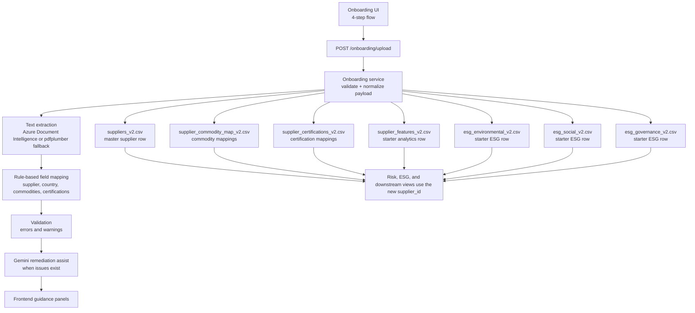

# Supplier AI System

This project is an AI-driven Supplier Intelligence application with a FastAPI backend and a React frontend. The current implementation is centered around a multi-step AI Assisted Supplier Onboarding module built on top of the existing `v2` CSV datasets, with supporting dashboard, risk, and advisor views.

## Current Stack
- Backend: FastAPI
- Frontend: React + Vite + TypeScript + Tailwind
- Data source: CSV datasets in `data/`
- AI integrations:
  - Azure Document Intelligence for document OCR/extraction
  - Gemini using `gemini-3.1-flash-lite-preview` for onboarding assist and advisor flows

## Active Application Modules
- AI Assisted Supplier Onboarding
- AI Assisted Auditing
- Overview Dashboard
- Risk Monitoring
- Due Diligence
- Supplier Advisor AI

## Routing
The frontend now uses Supplier Onboarding as the default entry flow.

- `/` redirects to `/onboarding`
- `/onboarding` is the primary intake module
- `/supplier-engagement` now hosts the shared Supplier Engagement workspace
- wildcard routes also redirect to `/onboarding`

## AI Assisted Auditing
Auditing now lives inside the Supplier Engagement workspace as a separate sub-module. The first auditing step is intentionally audit-centric and does not require any new uploads.

### Tab 1: Audit Queue
Frontend:
- Supplier Engagement now includes a dedicated `Auditing` module tab
- The auditing workspace includes 3 internal tabs:
  - `Audit Queue`
  - `Audit Review`
  - `AI Audit Insights`
- `Audit Queue` is the first implemented step
- Queue cards/rows show:
  - supplier name
  - supplier country
  - supplier ID
  - audit type
  - audit date
  - audit score
  - non-compliance count
  - audit status
- Queue filter chips currently support:
  - `All`
  - `High priority`
  - `Open review`
  - `External`
- The selected audit is tracked in UI and will be reused by the next two auditing tabs
- No supplier PDF, image, or certification upload is required for this first auditing version

Backend / data basis:
- This first auditing step is currently read-only and grounded in existing `v2` datasets
- The queue is built from the existing shape of:
  - `data/audits_v2.csv`
  - `data/suppliers_v2.csv`
  - `data/supplier_certifications_v2.csv`
- No new tables are introduced
- No new upload endpoint is required for the first auditing slice
- This keeps Auditing truthful to the current data model while later tabs add review and AI interpretation layers

## AI Assisted Supplier Onboarding
The onboarding experience lives at `/onboarding` and currently supports 4 steps using the existing `v2` data model.

### Step 1: Document Upload
Frontend:
- Supplier document upload input
- Upload and extraction trigger
- Extracted value preview for supplier name, country, commodities, and certifications
- Validation summary with errors and warnings
- AI remediation assist panel when warnings/errors exist
- AI country guidance now includes both:
  - a direct suggested country when confidence is strong enough
  - a ranked `possible countries` list when the country is ambiguous
- Raw extracted text preview
- Handoff action into the next onboarding tab

Backend:
- `POST /onboarding/upload` accepts either a file upload or a structured form submission
- `backend/app/services/onboarding_service.py` uses Azure Document Intelligence when credentials are available
- The onboarding service also supports the existing `.env` naming currently used in the project:
  - `DOCUMENT_INTELLIGENCE_ENDPOINT`
  - `DOCUMENT_INTELLIGENCE_KEY`
- If Azure extraction is unavailable or fails, the service falls back to local PDF text extraction using `pdfplumber`
- Extracted text is mapped into `supplier_name`, `country`, `commodities`, and `certifications`
- The rule-based country matcher supports:
  - India
  - Indonesia
  - Brazil
  - USA
  - China
  - Vietnam
  - Germany
  - Thailand
  - Malaysia
  - Singapore
  - Philippines
  - Mexico
  - Netherlands
  - France
  - UK
- Validation checks ensure supplier name, country, and at least one commodity are present
- When warnings or errors exist, Gemini is used to generate onboarding remediation guidance

### Step 2: Supplier Details
Frontend:
- Editable supplier fields for `supplier_name`, `country`, `tier`, `size`, `annual_revenue`, `onboarding_date`, and `status`
- Defaults seeded from extracted document values where available
- Readiness card showing required-field completion
- Navigation into the commodity and certification mapping step

Backend:
- The onboarding API accepts `tier`, `size`, `annual_revenue`, `onboarding_date`, and `status`
- These values are appended into `data/suppliers_v2.csv` together with the new supplier record
- The backend also generates starter `dependency_score` and `criticality_score` values using dataset averages so downstream modules have complete supplier rows

### Step 3: Commodities and Certifications
Frontend:
- Structured commodity selection based on `data/commodities_v2.csv`
- Commodity risk context with risk level and deforestation risk score
- Structured certification selection based on `data/certifications_v2.csv`
- Certification rows for `issue_date`, `expiry_date`, and `status`
- Mapping readiness summary before final review

Backend:
- Final submission sends selected commodity names, certification names, and certification row metadata to the onboarding endpoint
- `backend/app/services/onboarding_service.py` maps those names to IDs using existing master tables
- Commodity mappings are appended into `data/supplier_commodity_map_v2.csv`
- Certification mappings are appended into `data/supplier_certifications_v2.csv` with persisted `issue_date`, `expiry_date`, and `status`

### Step 4: Review and Submit
Frontend:
- Final summary of supplier details
- Review of selected commodities and certifications
- Submission readiness checklist
- Certification row review panel
- AI validation guidance panel when issues remain
- Submit action with success state and created supplier ID

Backend:
- Valid submissions append a new supplier record into `data/suppliers_v2.csv`
- Commodity mappings are appended into `data/supplier_commodity_map_v2.csv`
- Certification mappings are appended into `data/supplier_certifications_v2.csv`
- A starter audit row is appended into `data/audits_v2.csv` so newly onboarded suppliers can enter the auditing queue immediately
- Starter supplier-linked rows are appended into:
  - `data/supplier_features_v2.csv`
  - `data/esg_environmental_v2.csv`
  - `data/esg_social_v2.csv`
  - `data/esg_governance_v2.csv`
- The response returns a confirmation message and the new supplier ID

## AI Assist For Warnings And Errors
The onboarding module includes an AI remediation layer powered by Gemini `gemini-3.1-flash-lite-preview`.

### What triggers the AI assist
The AI assist runs when onboarding validation returns warnings or errors, for example:
- missing country
- missing commodity
- no certification detected
- partial or noisy extraction output
- country text that is ambiguous or present only through indirect context

### What the AI assist does
Backend:
- builds a remediation prompt using:
  - extracted supplier fields
  - validation errors and warnings
  - raw extracted text
  - supported countries, commodities, and certifications
- asks Gemini to return strict JSON guidance
- normalizes the result into:
  - `summary`
  - `canProceed`
  - `suggestedFields`
    - `supplier_name`
    - `country`
    - `possibleCountries`
    - `commodities`
    - `certifications`
  - `actions`
  - `confidence`
- if country cannot be stated confidently, Gemini can return up to 3 ranked `possibleCountries`

Frontend:
- shows an `AI remediation assist` panel in the upload/validation area
- shows suggested values for:
  - supplier name
  - country
  - possible countries
  - commodities
  - certifications
- shows suggested next actions in plain language
- shows confidence so the user understands whether the guidance is strong or tentative
- shows `AI validation guidance` again in the final review tab when relevant

### What AI is doing versus the rule-based layer
Rule-based extraction:
- first non-empty line becomes supplier name
- country is matched from a supported country list
- commodities are detected by keyword matching
- certifications are detected by keyword matching

Gemini assist:
- interprets noisy or incomplete extracted text
- suggests likely structured values from the supported onboarding vocabulary
- can return a ranked list of possible countries when the exact country is uncertain
- explains how the user can resolve warnings/errors
- improves the remediation UX without replacing the deterministic base extraction layer

## Data Flow


### Data Flow Summary
1. The onboarding UI collects supplier details, commodity mappings, and certification metadata.
2. The frontend submits one payload to `POST /onboarding/upload`.
3. The backend extracts document text with Azure Document Intelligence or local PDF fallback.
4. The onboarding service runs deterministic field mapping and validation.
5. If issues exist, Gemini generates structured remediation guidance.
6. A new `supplier_id` is created from the existing supplier master table.
7. The same `supplier_id` is reused while appending rows into all related existing `v2` tables.
8. Downstream dashboards and risk/ESG modules can then reference the new supplier consistently.

## Current Onboarding Persistence Scope
The current onboarding implementation writes only to existing `v2` CSV tables. No new tables are created.

Persisted now from onboarding:
- `data/suppliers_v2.csv`
  - `supplier_name`
  - `country`
  - `tier`
  - `size`
  - `annual_revenue`
  - `onboarding_date`
  - `status`
  - generated `dependency_score`
  - generated `criticality_score`
- `data/supplier_commodity_map_v2.csv`
- `data/supplier_certifications_v2.csv`
- `data/audits_v2.csv`
- `data/supplier_features_v2.csv`
- `data/esg_environmental_v2.csv`
- `data/esg_social_v2.csv`
- `data/esg_governance_v2.csv`

Captured in frontend and persisted in backend for certifications:
- certification name
- issue date
- expiry date
- status

Not appended during onboarding by design:
- `data/alerts_v2.csv`
- transaction datasets

Those are better produced by later auditing, monitoring, and operations workflows rather than supplier intake itself.

Starter audit behavior for newly onboarded suppliers:
- Onboarding now creates one `Initial` audit row in `data/audits_v2.csv`
- The row is not identical for every supplier
- Shared base fields:
  - `supplier_id` = newly created supplier ID
  - `audit_date` = onboarding date
  - `type` = `Initial`
- Derived starter values:
  - `score` is adjusted from a conservative baseline using onboarding context such as:
    - certification count
    - commodity count
    - tier
    - size
  - `non_compliance` is also lightly derived from onboarding context instead of being constant for every supplier
- This starter row is meant to place the supplier into the auditing queue immediately, not to represent a completed audit

## Project Structure
```text
supplier-risk-intelligence-react/
+-- backend/
|   +-- app/
|   |   +-- core/
|   |   +-- routers/
|   |   +-- schemas/
|   |   +-- services/
+-- data/
+-- frontend/
|   +-- src/
|   +-- package.json
+-- uploads/
+-- requirements.txt
+-- README.md
```

## Local Setup

1. Install Python dependencies
```bash
pip install -r requirements.txt
```

2. Install frontend dependencies
```bash
cd frontend
npm install
```

3. Configure environment variables in `.env`
- `BLOB_CONNECTION_STRING`
- `DOCUMENT_INTELLIGENCE_ENDPOINT`
- `DOCUMENT_INTELLIGENCE_KEY`
- `GEMINI_API_KEY`
- `AZURE_DOC_INTELLIGENCE_ENDPOINT`
- `AZURE_DOC_INTELLIGENCE_KEY`

## Run Locally

Start the backend from the repository root:
```bash
python -m uvicorn backend.api:app --reload
```

In a second terminal, start the React frontend:
```bash
cd frontend
npm run dev
```

Open:
- React app: `http://localhost:5173`
- FastAPI docs: `http://localhost:8000/docs`

## Notes
- The React app expects the backend at `http://localhost:8000`
- Supplier Onboarding is now the default entry module
- CSV files are still the current persistence layer
- AI Assisted Onboarding appends new suppliers across the relevant existing `v2` supplier, mapping, features, and ESG tables
- The onboarding service supports both Azure extraction and local PDF fallback for testing
- Full frontend production build verification is currently blocked in this environment by a Vite/esbuild `spawn EPERM` error
