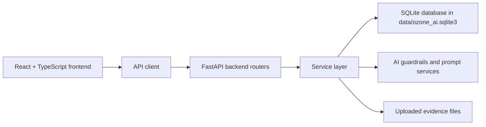
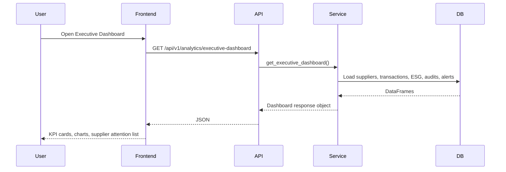
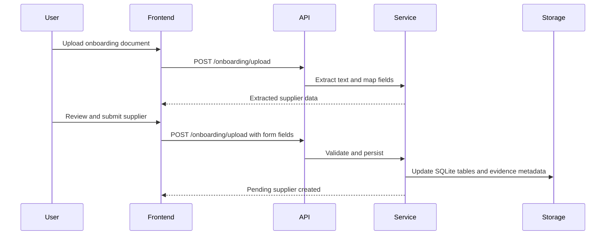
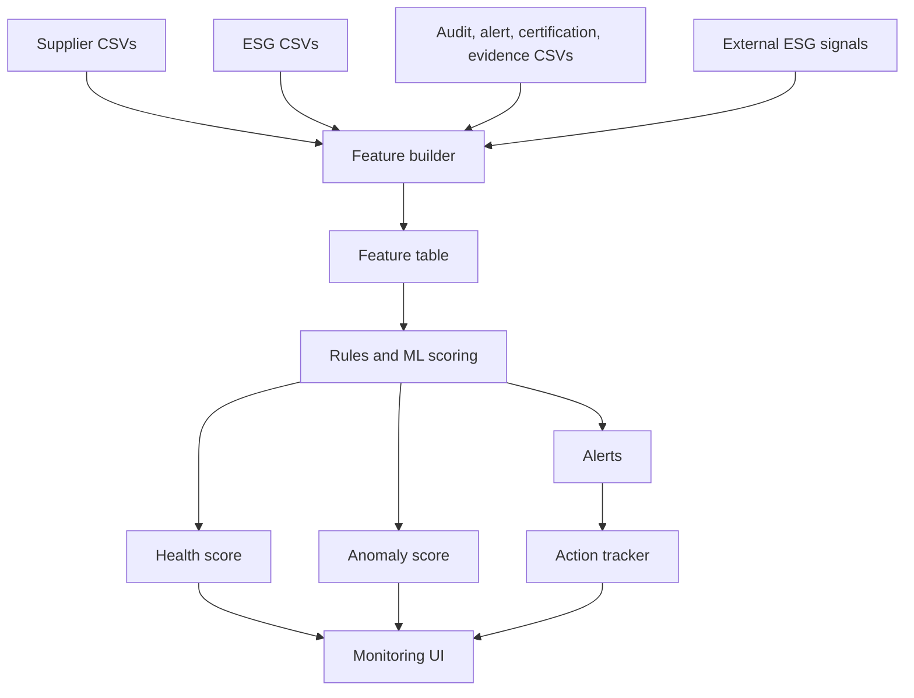

# Ozone AI 4.0 Technical Documentation

## 1. Technical Overview

Ozone AI 4.0 is implemented as a full-stack web application.

The main layers are:

- React frontend for the user interface.
- FastAPI backend for APIs and business logic.
- SQLite as the current local persistence layer.
- Pandas-based services for data loading, joining, scoring, and summaries.
- AI service abstractions, prompt guardrails, and output validation for assistant-style workflows.



## 2. Frontend Technology Stack

The frontend is located in `frontend/`.

Important technologies:

| Technology | Usage |
| --- | --- |
| React 18 | Builds UI pages and components |
| TypeScript | Adds typed contracts for frontend APIs and components |
| Vite | Development server and production build tooling |
| React Router | Client-side routing between pages |
| TanStack React Query | API data fetching, loading state, caching, and mutations |
| Plotly / React Plotly | Advanced charts and visualizations |
| Recharts | Dashboard-style charts |
| React Simple Maps | Map visualizations |
| Tailwind CSS / CSS variables | Styling and layout |

Frontend scripts:

```bash
npm run dev
npm run build
npm run preview
```

## 3. Backend Technology Stack

The backend is located in `backend/app/`.

Important technologies from `requirements.txt`:

| Technology | Usage |
| --- | --- |
| FastAPI | REST API framework |
| Uvicorn | ASGI server for running FastAPI |
| Pydantic | Request and response schema validation |
| Pandas | Table loading, joining, grouping, and calculations |
| NumPy | Numerical processing support |
| scikit-learn | Machine learning and scoring utilities |
| OpenAI | AI assistant and generation integration |
| Google GenAI | Additional AI provider dependency |
| Azure AI Form Recognizer | Document extraction support |
| Azure Storage Blob | Future or optional storage integration |
| Azure Identity / Azure Core | Azure authentication and SDK support |
| python-dotenv | Local environment configuration |
| pytest | Testing support |

## 4. Application Architecture

### Frontend Layer

The frontend renders pages and calls backend APIs through typed API files in `frontend/src/api/`.

Important frontend files:

| File | Purpose |
| --- | --- |
| `frontend/src/App.tsx` | Defines routes |
| `frontend/src/components/layout/AppShell.tsx` | Shared header, navigation, floating Advisor AI button |
| `frontend/src/api/client.ts` | Shared API request helper |
| `frontend/src/api/analytics.ts` | Analytics and dashboard API functions |
| `frontend/src/api/simulator.ts` | Simulator API functions |
| `frontend/src/api/risk.ts` | Risk and due diligence API functions |
| `frontend/src/api/advisor.ts` | Advisor AI API functions |
| `frontend/src/api/esgMonitoring.ts` | ESG Monitoring API contract |
| `frontend/src/pages/SupplierEngagementPage.tsx` | Parent workspace for onboarding, auditing, traceability |

### Backend Layer

The FastAPI application is created in `backend/app/main.py`.

It registers:

- CORS middleware.
- Exception handlers.
- Health router.
- Dataset router.
- Auditing router.
- Analytics router.
- Advisor router.
- AI review router.
- ESG monitoring router.
- Risk router.
- Simulator router.
- Onboarding router.
- Traceability router.

### Data Layer

The current data store is SQLite-based. The database file is `data/ozone_ai.sqlite3`.

The project previously used one CSV per dataset. Those CSVs have been migrated into SQLite tables and removed from `data/`. A lightweight Pandas compatibility bridge maps legacy CSV path reads/writes to SQLite tables while the service layer is gradually refactored toward direct table access. In a production version, the same table model can move to PostgreSQL.

## 5. Route Architecture

Frontend routes:

| Route | Component |
| --- | --- |
| `/executive-dashboard` | `ExecutiveDashboardPage` |
| `/simulator` | `SimulatorPage` |
| `/analytics` | `AnalyticsPage` |
| `/supplier-engagement` | `SupplierEngagementPage` |
| `/esg-monitoring` | `EsgMonitoringPage` |
| `/due-diligence-agent` | `DueDiligencePage` |
| `/advisor-ai` | `SupplierAdvisorAIPage` |

Redirect routes:

| Route | Redirects To |
| --- | --- |
| `/` | `/executive-dashboard` |
| `/onboarding` | `/supplier-engagement` |
| `/overview-dashboard` | `/executive-dashboard` |
| `/risk-monitoring` | `/analytics` |
| `/due-diligence` | `/due-diligence-agent` |

## 6. Backend API Architecture

### Analytics APIs

Base route: `/api/v1/analytics`

Important endpoints:

- `GET /overview`
- `GET /executive-dashboard`
- `GET /country-distribution`
- `GET /country-analysis`
- `GET /commodity-analysis`
- `GET /supplier-rankings`
- `GET /certification-analysis`
- `GET /esg-pillar-analysis`
- `GET /trend-analysis`
- `GET /risk-distributions`
- `GET /esg-distribution`

Technical pattern:

1. Router receives HTTP request.
2. Service loads relevant SQLite tables using Pandas.
3. Service joins supplier, ESG, certification, commodity, and transaction data.
4. Service calculates metrics.
5. Pydantic schema validates response.
6. Frontend renders charts and tables.

### Simulator APIs

Base route: `/api/v1/simulator`

Endpoints:

- `GET /options`
- `POST /run`

Technical pattern:

1. Frontend asks for available suppliers, countries, commodities, and scenario options.
2. User submits scenario.
3. Backend creates a before-and-after risk frame.
4. Service applies scenario-specific risk changes.
5. Service recomputes overall risk.
6. Response includes impact summary, changed suppliers, and deltas.

### Risk and Due Diligence APIs

Base route: `/api/v1/risk`

Endpoints:

- `GET /overview`
- `GET /distribution`
- `GET /segmentation`
- `GET /top-suppliers`
- `POST /due-diligence`

Technical pattern:

1. Build supplier risk frame.
2. Combine transaction metrics, audit metrics, alert metrics, certification metrics, commodity metrics, supplier metrics, ESG metrics, and country risk.
3. Score risk features.
4. Classify suppliers into risk levels.
5. For due diligence, generate supplier-specific drivers, evidence gaps, actions, and checklist.

### Onboarding APIs

Base route: `/onboarding`

Endpoints:

- `POST /upload`
- `POST /evidence/upload`
- `POST /decision`
- `POST /activate`
- `POST /revalidate`

Technical pattern:

1. Upload document or form data.
2. Extract text from document where applicable.
3. Map extracted text to supplier fields.
4. Validate fields.
5. Score ESG baseline.
6. Persist supplier, certification, evidence, ESG, traceability, and audit starter rows into SQLite tables.
7. Use AI assistance where configured, with guardrails and fallback logic.

### Auditing APIs

Base route: `/auditing`

Endpoints:

- `GET /workspace`
- `POST /insights`
- `POST /decision`
- `POST /decision/apply`
- `POST /close`
- `POST /capa`
- `PATCH /capa`
- `POST /evidence/upload`
- `POST /certification-update`
- `POST /certification-extract`

Technical pattern:

1. Load audit workspace data from SQLite.
2. Generate insights or decision recommendation.
3. Persist changes to audit, CAPA, certification, and evidence files.
4. Use document extraction where relevant.

### Traceability APIs

Base route: `/traceability`

Endpoints:

- `GET /workspace`
- `POST /gap-actions`
- `PATCH /gap-actions/{gap_id}`
- `POST /decision`
- `POST /evidence/review`
- `POST /evidence/upload`

Technical pattern:

1. Load suppliers, sites, lots, events, certifications, evidence, and gaps.
2. Build traceability score and EUDR readiness.
3. Manage gap action creation and updates.
4. Review uploaded evidence and apply effects to supplier traceability flags.
5. Persist decisions and score history.

### Advisor AI APIs

Base route: `/api/v1/advisor`

Endpoints:

- `POST /sessions`
- `GET /sessions/{session_id}`
- `POST /sessions/{session_id}/messages`

Technical pattern:

1. Create chat session.
2. Store or retrieve session messages.
3. User sends message with optional page lens and simulator context.
4. Backend builds grounded response using available context and AI guardrails.
5. Response is returned to frontend chat UI.

### AI Review APIs

Base route: `/api/v1/ai-review`

Endpoints:

- `GET /queue`
- `POST /queue/{item_id}`

Technical pattern:

1. Retrieve pending or reviewed AI items.
2. User approves, rejects, or reviews AI item.
3. Decision is persisted through the review service or queue handling logic.

### ESG Monitoring API

Base route: `/api/v1/esg-monitoring`

Endpoint:

- `GET /overview`

Current technical status:

- Backend service exists.
- Frontend API contract exists.
- Frontend page is currently blank and does not render the monitoring UI.

## 7. Data Model Overview

Important SQLite tables:

| File | Technical Role |
| --- | --- |
| `suppliers` | Main supplier master table |
| `transactions` | Transaction history and volume |
| `esg_environmental` | Environmental ESG indicators |
| `esg_social` | Social ESG indicators |
| `esg_governance` | Governance ESG indicators |
| `certifications` | Certification reference list |
| `supplier_certifications` | Supplier certification records |
| `commodities` | Commodity reference list |
| `supplier_commodity_map` | Supplier-to-commodity mappings |
| `audits` | Audit records |
| `audit_capa` | Corrective action records |
| `audit_evidence` | Audit evidence metadata |
| `alerts` | Supplier alert records |
| `supplier_evidence` | Supplier evidence metadata |
| `supplier_features` | Derived or model-ready supplier feature fields |
| `traceability_*` | Traceability sites, lots, events, gaps, decisions, score history |
| `monitoring_*` | Seed data for future monitoring |
| `external_esg_signals` | External ESG signal examples |

## 8. Data Flow Example: Executive Dashboard



## 9. Data Flow Example: Onboarding



## 10. Feature-to-Technology Mapping

| Feature | Frontend | Backend | Data / Processing |
| --- | --- | --- | --- |
| Executive Dashboard | React, React Query, charts | Analytics router/service | Pandas aggregation across supplier data |
| Analytics | React, Plotly, Recharts, maps | Analytics APIs | Country, commodity, ESG, certification, trend calculations |
| Simulator | React forms and scenario UI | Simulator service | Risk frame recomputation in Pandas |
| Onboarding | Upload UI, form workflow | Onboarding router/service | Document extraction, validation, SQLite persistence |
| Auditing | Workspace UI | Auditing router/service | Audit, CAPA, certification, evidence data |
| Traceability | Workspace UI | Traceability router/service | Sites, lots, events, evidence, score calculations |
| Due Diligence | Supplier investigation UI | Risk service | Risk driver and evidence gap generation |
| Advisor AI | Chat page and overlay | Advisor router/service | AI context, guardrails, session messages |
| AI Review | Queue page component | AI review router | Human review of AI items |
| ESG Monitoring | Route exists, page blank | ESG monitoring service exists | Monitoring seed data and calculated overview |

## 11. AI Architecture

The AI-related code is structured around:

- Prompt registry.
- Guardrails.
- Output validation.
- Deterministic fallback behavior.
- Review queue support.

Important files:

| File | Purpose |
| --- | --- |
| `backend/app/ai/guardrails.py` | Blocks unsafe or unsupported AI requests |
| `backend/app/ai/prompt_registry.py` | Stores prompt policy and feature prompt definitions |
| `backend/app/ai/output_validation.py` | Validates AI-generated structured outputs |
| `data/ai_audit_events.jsonl` | Stores AI audit trail examples |

Important design principle:

AI is advisory. It should not create final procurement, legal, compliance, or audit decisions without human review.

## 12. Current ESG Monitoring Technical Status

### Frontend

File:

- `frontend/src/pages/EsgMonitoringPage.tsx`

Current implementation:

```tsx
export function EsgMonitoringPage() {
  return null;
}
```

This means:

- Route exists.
- Navigation can open the page.
- No UI content is rendered.

### Frontend API Contract

File:

- `frontend/src/api/esgMonitoring.ts`

It defines types and a function for:

- `GET /api/v1/esg-monitoring/overview`

### Backend

Files:

- `backend/app/routers/esg_monitoring.py`
- `backend/app/services/esg_monitoring_service.py`
- `backend/app/schemas/esg_monitoring.py`

The backend has logic for:

- Monitoring overview.
- Monitoring KPIs.
- ESG indicator summaries.
- Supplier watchlist.
- Alert items.
- ML-style anomaly insights.

The UI was intentionally removed, but the backend foundation still exists.

## 13. Future ESG Monitoring Technical Implementation Plan

This section maps proposed ML Continuous ESG Monitoring features to technical implementation work.

### 13.1 Monitoring Command Center

Functional goal:

Show a central ESG monitoring dashboard.

Technical implementation:

- Rebuild `EsgMonitoringPage.tsx` using React and React Query.
- Call `useEsgMonitoringOverview`.
- Render KPI cards, watchlist, alert stream, and trend charts.
- Use existing backend endpoint first.
- Add new endpoints later if interaction grows.

Possible components:

- `MonitoringKpiStrip`
- `SupplierWatchlistTable`
- `EsgAlertStream`
- `EsgTrendPanel`
- `IndicatorHeatmap`

### 13.2 Supplier ESG Health Score

Functional goal:

Give each supplier a simple ESG health score.

Technical implementation:

- Combine environmental, social, and governance risk fields.
- Normalize scores to 0 to 100.
- Invert risk where needed so higher health means better condition.
- Store monthly score snapshots in a future table.

Example formula:

```text
ESG health = 100 - weighted ESG risk
weighted ESG risk = environmental * 0.4 + social * 0.35 + governance * 0.25
```

Future data store:

- `supplier_esg_monthly_snapshots`

Current prototype option:

- `data/monitoring_observations_v2.csv`

### 13.3 ML Anomaly Detection

Functional goal:

Identify suppliers whose ESG behavior looks unusual.

Technical implementation options:

Option 1, rule-plus-score prototype:

- Use Pandas to calculate changes and thresholds.
- Flag suppliers above a risk threshold.
- Flag sudden month-over-month increases.

Option 2, unsupervised ML:

- Use scikit-learn IsolationForest or LocalOutlierFactor.
- Input features can include ESG risk, alerts, certification gaps, audit non-compliance, evidence age, country risk, commodity risk, and transaction dependency.

Example features:

| Feature | Meaning |
| --- | --- |
| `environmental_risk_score` | Environmental supplier risk |
| `social_risk_score` | Social supplier risk |
| `governance_risk_score` | Governance supplier risk |
| `open_alert_count` | Number of open supplier alerts |
| `evidence_age_days` | Age of latest evidence |
| `expired_certification_count` | Number of expired certifications |
| `audit_non_compliance_count` | Audit issues |
| `country_risk_score` | Country-level risk |
| `commodity_pressure_score` | Commodity-level risk |

Output:

- `ml_anomaly_score`
- `ml_signal_label`
- `top_anomaly_drivers`

### 13.4 Trend Monitoring

Functional goal:

Show whether suppliers are improving, stable, or deteriorating.

Technical implementation:

- Persist monthly snapshots.
- Calculate rolling averages.
- Compare latest score vs previous month or quarter.
- Generate trend labels.

Example labels:

- `Improving`
- `Stable`
- `Deteriorating`
- `New critical signal`

Technical endpoints:

- `GET /api/v1/esg-monitoring/trends`
- `GET /api/v1/esg-monitoring/suppliers/{supplier_id}/history`

### 13.5 Alert Stream and Alert Lifecycle

Functional goal:

Show ESG alerts and allow users to manage them.

Technical implementation:

- Use `monitoring_alerts_v2.csv` for prototype alert records.
- Add alert status update endpoint.
- Add alert assignment, due date, and notes.

Suggested endpoints:

- `GET /api/v1/esg-monitoring/alerts`
- `PATCH /api/v1/esg-monitoring/alerts/{alert_id}`
- `POST /api/v1/esg-monitoring/alerts/{alert_id}/notes`

Suggested fields:

- `alert_id`
- `supplier_id`
- `indicator`
- `severity`
- `status`
- `owner`
- `due_date`
- `created_at`
- `resolved_at`
- `linked_action_id`

### 13.6 Monitoring Actions

Functional goal:

Turn alerts into business follow-up actions.

Technical implementation:

- Use `monitoring_actions_v2.csv` as prototype storage.
- Add create/update endpoints.
- Link actions to alerts and suppliers.

Suggested endpoints:

- `POST /api/v1/esg-monitoring/actions`
- `PATCH /api/v1/esg-monitoring/actions/{action_id}`
- `GET /api/v1/esg-monitoring/actions?status=open`

### 13.7 Evidence Refresh Monitoring

Functional goal:

Track stale or missing supplier evidence.

Technical implementation:

- Use `supplier_evidence_v2.csv`.
- Use `supplier_evidence_refresh_v2.csv`.
- Calculate evidence age.
- Derive status:
  - `Current`
  - `Due soon`
  - `Expired`
  - `Missing`

Possible endpoint:

- `GET /api/v1/esg-monitoring/evidence-refresh`

### 13.8 External ESG Signal Ingestion

Functional goal:

Include ESG signals from outside the internal data files.

Technical implementation:

Prototype:

- Use `external_esg_signals_v2.csv`.
- Treat each row as signal input.

Production:

- Scheduled ingestion jobs.
- External APIs or file drops.
- Deduplication and entity matching.
- Signal severity classification.

Possible components:

- Signal ingestion service.
- Supplier/entity matching service.
- Alert generation service.
- Signal audit log.

### 13.9 Monthly Snapshot Builder

Functional goal:

Persist supplier ESG state over time.

Technical implementation:

- Create a scheduled job that runs monthly.
- Load current supplier/ESG/evidence/audit/certification data.
- Calculate monitoring features.
- Save snapshot records.

Suggested future table:

```text
supplier_esg_monitoring_snapshots
- snapshot_id
- supplier_id
- snapshot_month
- environmental_risk
- social_risk
- governance_risk
- esg_health_score
- anomaly_score
- open_alert_count
- stale_evidence_count
- certification_gap_count
- trend_label
```

### 13.10 ML Monitoring Pipeline Diagram



## 14. Suggested Future Database Design

The current CSV approach is fine for prototype work. For production, recommended storage would include:

| Area | Recommended Store |
| --- | --- |
| Supplier master data | Relational database |
| Transactions | Database or data warehouse |
| Evidence files | Object storage such as Azure Blob Storage |
| Evidence metadata | Relational database |
| ESG snapshots | Time-series table or warehouse table |
| External signals | Event store or normalized signal table |
| AI audit logs | Append-only log table |
| Monitoring alerts/actions | Relational workflow tables |

## 15. Non-Functional Considerations

### Security

- Add authentication and role-based access.
- Restrict who can approve suppliers, close audits, and resolve alerts.
- Protect uploaded evidence files.
- Audit all AI-assisted decisions.

### Data Quality

- Validate CSV or database inputs.
- Track missing supplier IDs.
- Standardize country and commodity names.
- Prevent duplicate supplier records.

### Reliability

- Add automated tests for scoring services.
- Add API contract tests.
- Add retry logic for external AI or document extraction services.

### Scalability

- Move from CSV to database.
- Cache dashboard aggregations.
- Use background jobs for snapshot generation.
- Use event-driven ingestion for external ESG signals.

### Explainability

- Every score should show drivers.
- Every AI recommendation should list evidence used.
- Every alert should explain why it was generated.

## 16. Build and Verification

Frontend build command:

```bash
cd frontend
npm run build
```

Known build note:

- The build currently completes successfully.
- Vite reports a large chunk warning because the generated JavaScript bundle is over 500 kB.
- This is a performance warning, not a build failure.

Possible future improvement:

- Add route-based code splitting.
- Move heavy chart libraries into lazy-loaded chunks.

## 17. Current Technical Summary

Implemented:

- React app shell and routing.
- Executive dashboard.
- Analytics.
- Simulator.
- Supplier Engagement workspace.
- Onboarding.
- Auditing.
- Traceability.
- Due Diligence Agent.
- Supplier Advisor AI.
- AI review backend and page component.
- FastAPI backend with routers and service layer.
- SQLite-backed persistence.
- AI guardrails and validation.

Blank by design:

- ESG Monitoring frontend page.

Available for future ESG Monitoring:

- Backend ESG monitoring API.
- ESG monitoring schemas.
- ESG monitoring service logic.
- Monitoring seed CSV data.
- External ESG signal CSV data.
