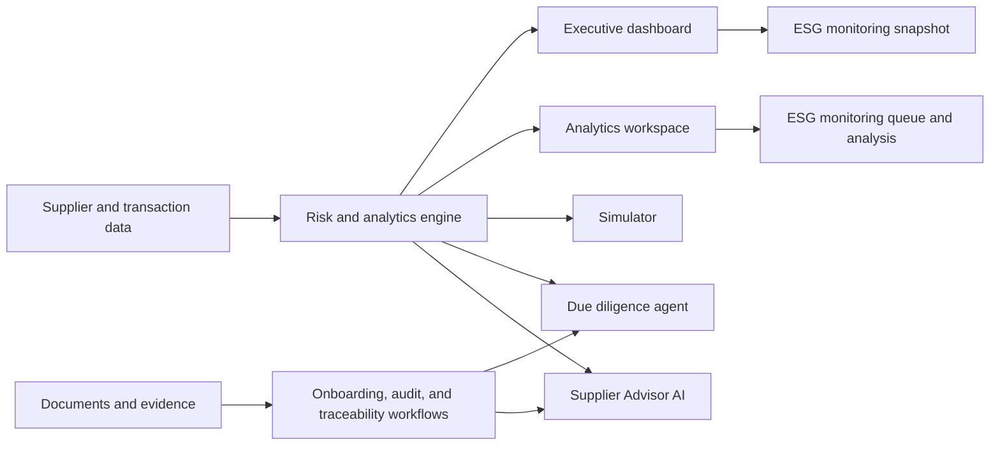
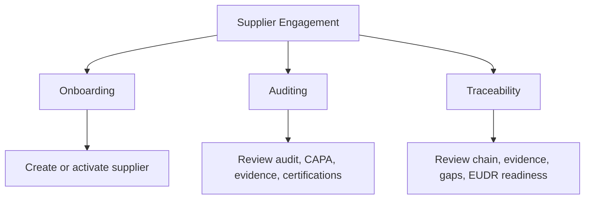
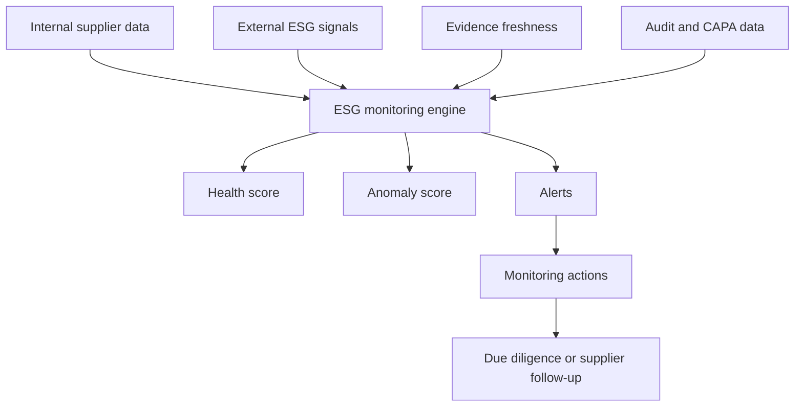

# Ozone AI 4.0 Functional Documentation

## 1. Purpose of the Application

Ozone AI 4.0 is a supplier intelligence platform for responsible sourcing teams. It helps a business understand supplier risk, supplier readiness, ESG posture, certifications, audits, traceability, due diligence, and what-if disruption scenarios.

In simple terms, the application answers questions like:

- Which suppliers need management attention?
- Which countries, commodities, or certifications are creating risk?
- What happens if a supplier, country, or commodity is disrupted?
- Is a supplier ready to be onboarded?
- Does a supplier have enough audit, traceability, and certification evidence?
- What should the next action be for a supplier?
- Can an AI assistant explain supplier risk in plain language?

The current system is a working prototype using Azure PostgreSQL as the data source. It has a React web application, a FastAPI backend, and multiple supplier intelligence modules.

## 2. User Groups

The application is useful for these business users:

- Procurement leaders who need a quick view of supplier exposure.
- Responsible sourcing teams who manage supplier ESG, traceability, and evidence.
- Compliance teams who review supplier certifications, audit status, and due diligence.
- Supplier onboarding teams who collect documents and decide whether a supplier can become active.
- Risk teams who analyze disruption scenarios and supplier concentration risk.
- Executives who need summaries instead of raw data.

## 3. High-Level Functional Flow

## 4. Current Navigation

The application currently exposes these main user-facing pages:

| Page | Route | Current Status |
| --- | --- | --- |
| Executive Dashboard | `/executive-dashboard` | Implemented |
| Simulator | `/simulator` | Implemented |
| Analytics | `/analytics` | Implemented |
| Supplier Engagement | `/supplier-engagement` | Implemented |
| Due Diligence Agent | `/due-diligence-agent` | Implemented |
| Supplier Advisor AI | `/advisor-ai` | Implemented |

Redirects are also configured:

- `/` goes to Executive Dashboard.
- `/onboarding` goes to Supplier Engagement.
- `/overview-dashboard` goes to Executive Dashboard.
- `/risk-monitoring` goes to Analytics.
- `/esg-monitoring` redirects to the ESG section inside Analytics.
- `/due-diligence` goes to Due Diligence Agent.

## 5. Feature 1: Executive Dashboard

### What It Does

The Executive Dashboard gives leadership a quick view of overall supplier health and risk. It is designed for scanning, not deep investigation.

It summarizes:

- Overall supplier risk.
- Supplier health.
- Geographic exposure.
- Commodity exposure.
- Certification health.
- Suppliers needing attention.
- Risk mix across the supplier network.

### Why It Matters

Executives usually do not want to inspect every supplier record. They need an answer to:

"Where should we focus today?"

For example, if the dashboard shows many suppliers in a high-risk country or many certifications close to expiry, leadership can ask the sourcing team to prioritize those areas.

### Example Scenario

A procurement head opens the dashboard and sees:

- Open supplier alerts are increasing.
- Several suppliers are deteriorating.
- One country has high concentration risk.
- Certification health is weaker for a commodity group.

The user can then move into Analytics or Due Diligence for deeper detail.

### Functional Inputs

- Supplier master data.
- Transactions.
- Supplier certifications.
- Audits.
- Alerts.
- ESG fields.
- Commodity mappings.

### Functional Output

- KPI cards.
- Geographic risk view.
- Supplier attention list.
- Risk mix summaries.
- Certification health indicators.

## 6. Feature 2: Analytics Workspace

### What It Does

The Analytics page is the detailed analysis area. It helps users compare supplier risk across different dimensions.

It includes analysis for:

- Countries.
- Commodities.
- Supplier rankings.
- Certifications.
- ESG pillars.
- Trends.
- Risk distributions.

### Why It Matters

Analytics helps answer "why" behind the dashboard numbers.

For example:

- If overall supplier risk is high, Analytics can show whether it is driven by one country, one commodity, or a group of suppliers.
- If ESG risk is rising, Analytics can show whether environmental, social, or governance factors are responsible.

### Example Questions It Supports

- Which countries have the highest average supplier risk?
- Which commodities are most exposed?
- Which suppliers are ranked highest by risk?
- How many suppliers are in low, medium, and high-risk buckets?
- Which certification gaps are most common?
- Are ESG scores improving or deteriorating?

### Functional Output

- Charts and visual breakdowns.
- Ranked supplier lists.
- Country and commodity comparisons.
- ESG pillar analysis.
- Risk distribution histograms.
- Trend views.

## 7. Feature 3: Simulator

### What It Does

The Simulator lets users test what could happen under disruption scenarios.

Current scenario types include:

- Supplier disruption.
- Country disruption.
- Commodity shock.
- Operational deterioration.

### Why It Matters

Real supply chains can be disrupted by many events:

- A supplier stops production.
- A country becomes unstable.
- A commodity becomes scarce.
- A supplier's operational performance deteriorates.

The Simulator helps users understand possible impact before it happens.

### Example Scenario

A user selects:

- Scenario type: Country disruption.
- Country: Brazil.
- Severity: High.

The system then estimates:

- Which suppliers are affected.
- How risk scores change.
- Which supplier risk bands move up.
- What business impact might occur.
- Which suppliers should be reviewed first.

### Functional Output

- Before-and-after risk comparison.
- Affected supplier list.
- Risk band movements.
- Business impact summary.
- Scenario explanation.
- Option to ask Supplier Advisor AI to explain the scenario.

## 8. Feature 4: Supplier Engagement Workspace

Supplier Engagement is a parent workspace that groups three related supplier lifecycle workflows:

- Onboarding.
- Auditing.
- Traceability.

## 9. Feature 4A: Supplier Onboarding

### What It Does

The Onboarding module helps bring new suppliers into the system. It supports document upload, data extraction, evidence upload, validation, AI-assisted recommendations, and supplier activation.

### Main Capabilities

- Upload onboarding documents.
- Extract supplier information from documents.
- Capture supplier profile data.
- Capture commodity, certification, ESG, and traceability fields.
- Upload evidence files.
- Validate evidence against onboarding needs.
- Generate an AI-assisted onboarding recommendation.
- Save pending supplier data.
- Activate supplier after review.
- Revalidate active suppliers.

### Why It Matters

Onboarding is usually document-heavy and error-prone. This module reduces manual effort by extracting and organizing supplier information.

### Example Scenario

A supplier sends a PDF or document containing:

- Supplier name.
- Country.
- Commodity.
- Certification.
- ESG baseline details.
- Traceability details.

The user uploads it. The system extracts the likely fields, highlights missing items, and helps decide whether the supplier should be:

- Approved.
- Approved with conditions.
- Sent back for more evidence.
- Rejected or blocked.

### Important Business Concept: AI-Assisted, Not Final Approval

The AI can recommend, explain, and summarize. It does not replace human approval. The system is designed to keep compliance, procurement, and audit decisions under human review.

## 10. Feature 4B: Auditing Workspace

### What It Does

The Auditing workspace supports supplier audit review and follow-up.

It includes:

- Audit workspace loading.
- Audit insight generation.
- Audit decision generation.
- Applying audit decisions.
- Closing audits.
- Creating and updating CAPA actions.
- Uploading audit evidence.
- Updating certifications.
- Extracting certification information from documents.

CAPA means Corrective and Preventive Action. It is a follow-up action when an audit finds a gap.

### Why It Matters

Audits generate findings. Findings need to become actions. Actions need owners, due dates, and status. This workspace connects those pieces.

### Example Scenario

An audit finds a supplier has weak labor documentation.

The user can:

1. Review audit details.
2. Ask for audit insights.
3. Create a CAPA action.
4. Upload evidence once the supplier responds.
5. Close the audit after review.

## 11. Feature 4C: Traceability Workspace

### What It Does

Traceability helps users understand whether a supplier's upstream chain and source evidence are complete enough.

It supports:

- Supplier traceability workspace.
- Supplier sites.
- Lots.
- Traceability events.
- Evidence upload.
- Evidence review.
- Gap actions.
- Traceability decision generation.
- EUDR readiness indicators.
- Score history.

EUDR means European Union Deforestation Regulation. In this context, it relates to whether supplier sourcing evidence is complete enough for deforestation-related compliance review.

### Why It Matters

For responsible sourcing, it is not enough to know the direct supplier. A company often needs to understand where materials came from, whether source sites are known, and whether evidence exists.

### Example Scenario

A cocoa supplier may need:

- Farm or site information.
- Lot movement records.
- Evidence that source location is known.
- Certification evidence.
- Gap closure actions.

The Traceability workspace helps review those items and decide whether the supplier is ready, incomplete, or risky.

## 12. Feature 5: Due Diligence Agent

### What It Does

The Due Diligence Agent performs a supplier-level investigation. It combines risk, ESG, audit, alert, certification, commodity, and transaction signals to recommend a review outcome.

### Why It Matters

Due diligence is deeper than a dashboard. It answers:

"For this specific supplier, what is concerning and what should we do next?"

### Example Scenario

A supplier has:

- High ESG risk.
- Open alerts.
- Certification gaps.
- Recent audit non-compliance.
- High commodity exposure.

The Due Diligence Agent can summarize:

- Key risk drivers.
- Missing evidence.
- Recommended decision.
- Follow-up checklist.
- Suggested actions.

### Functional Output

- Supplier decision recommendation.
- Risk drivers.
- Evidence gaps.
- Action list.
- Due diligence checklist.
- Persisted due diligence case records.

## 13. Feature 6: Supplier Advisor AI

### What It Does

Supplier Advisor AI is a conversational assistant for supplier intelligence. Users can ask questions about suppliers, risks, scenarios, and page context.

It has:

- A full Advisor AI page.
- A floating chat button.
- A chat overlay available from the app shell.
- Context-aware prompts.
- Lens-based behavior depending on the page or workflow.

### Why It Matters

Many users do not want to interpret charts manually. They want to ask:

- "Why is this supplier risky?"
- "Explain this simulation result."
- "What should I do next?"
- "Which evidence is missing?"

The Advisor translates system data into business language.

### Example Scenario

After running a simulator scenario, a user clicks "Ask Advisor to Explain This Scenario."

The Advisor can explain:

- What changed.
- Which suppliers were affected.
- Which risk drivers matter most.
- What actions the business should consider.

## 14. Feature 7: AI Review Queue

### What It Does

The backend has an AI review queue for outputs that need human review. A frontend page file exists, but it is not currently registered as a route in the main app navigation.

### Why It Matters

AI-generated outputs should be reviewed when:

- Confidence is low.
- Guardrails were triggered.
- The decision has compliance impact.
- The recommendation needs human approval.

### Current Status

- Backend API exists.
- Frontend page component exists.
- It is not currently exposed in the main route list.

## 15. Feature 8: AI Guardrails and Human Review

### What It Does

The system includes guardrails to prevent unsafe or unsupported AI behavior.

It is designed to avoid:

- Inventing fake suppliers.
- Inventing fake certifications.
- Inventing fake audit findings.
- Treating AI output as final legal, compliance, audit, or procurement decisions.
- Bypassing required human review.

### Why It Matters

Supplier compliance decisions can affect business, legal, and sourcing outcomes. The AI should assist, not make final decisions on its own.

## 16. Data Used by the Application

The system currently uses Azure PostgreSQL. The earlier CSV datasets have been migrated into database tables.

Important data groups:

| Data Group | What It Represents |
| --- | --- |
| Supplier master data | Supplier name, country, tier, onboarding status, role, revenue, flags |
| Transactions | Purchase or transaction activity |
| ESG data | Environmental, social, and governance indicators |
| Certifications | Certification types, status, expiry, evidence links |
| Audits | Audit findings, status, non-compliance, audit lifecycle |
| Alerts | Supplier alerts and risk triggers |
| Commodities | Commodity reference data and supplier mappings |
| Evidence | Uploaded supplier documents and evidence metadata |
| Traceability | Sites, lots, events, gaps, decisions, score history |
| Monitoring seed data | Monitoring alerts, observations, rules, actions, and external ESG signals |

## 17. ESG Monitoring Integrated Into Dashboard and Analytics

### What It Does

ESG Monitoring is no longer a standalone page. The application now places ESG monitoring where users already make decisions:

- Executive Dashboard shows a leadership-level ESG monitoring snapshot.
- Analytics shows the detailed ESG monitoring queue, open alerts, indicator breakdowns, and ML anomaly context.

The old `/esg-monitoring` route redirects users to the ESG section inside Analytics.

### Why It Matters

ESG monitoring is not a separate user journey by itself. Executives need a concise ESG attention snapshot, while analysts need the deeper investigation queue. Splitting the functionality across Executive Dashboard and Analytics keeps the experience useful instead of creating another page to maintain.

### Current Functional Scope

- Executive Dashboard ESG snapshot:
  - Open ESG alert count.
  - Deteriorating supplier count.
  - Average ESG health.
  - Supplier to review first.
  - Highest open ESG alert.
  - Link into Analytics ESG analysis.
- Analytics ESG monitoring:
  - Supplier monitoring queue.
  - Monitoring priority by ESG risk, alerts, status, and ML anomaly score.
  - Open alert summary.
  - ESG indicator breakdown.
  - ML review context and flagged suppliers.

### Current Data Sources

Both Executive Dashboard and Analytics use the existing ESG Monitoring overview API. The backend combines internal supplier data with ESG, commodity, risk, alert, and model-ready feature calculations.

The current implementation is an internal-data monitoring layer. Public API ingestion is not yet live, but the service is designed so public ESG feeds can be added into the monitoring engine later.

## 18. Continuous ESG Monitoring Capability

This section explains the implemented monitoring capability and the extension path for public ESG feeds.

### 18.1 Executive Monitoring Snapshot

The Executive Dashboard snapshot shows the current ESG health of the supplier network.

Current user view:

- Total suppliers monitored.
- Suppliers with open ESG alerts.
- Suppliers deteriorating over time.
- Suppliers with missing evidence.
- Average ESG health score.
- Open monitoring actions.

Example:

"12 suppliers have deteriorated in the last 30 days. 5 of them are linked to palm oil and 3 have expired labor evidence."

### 18.2 Supplier ESG Health Score

Each supplier gets an ESG health score that summarizes environmental, social, and governance condition.

Example interpretation:

- 80 to 100: Strong health.
- 60 to 79: Watch.
- 40 to 59: Needs review.
- Below 40: Critical.

Business use:

Users can quickly understand which suppliers are stable and which need attention.

### 18.3 ML Anomaly Detection

The system detects unusual supplier behavior or risk changes.

Examples:

- A supplier's social risk suddenly increases.
- A supplier's evidence freshness drops sharply.
- A supplier receives more alerts than similar suppliers.
- ESG risk increases even though transaction volume remains high.

Business use:

Instead of waiting for quarterly reviews, users can catch early warning signs.

### 18.4 Trend Monitoring

Show whether a supplier is improving, stable, or deteriorating.

Example:

Supplier A has:

- Environmental risk up by 12 points.
- Governance risk stable.
- Social risk down by 5 points.

The system labels the supplier as "Environmental deterioration."

### 18.5 Alert Stream

A live-style list of ESG alerts.

Alert examples:

- Certification expired.
- Labor questionnaire overdue.
- External ESG signal received.
- Deforestation risk increased.
- Audit evidence not refreshed.
- Supplier has repeated unresolved CAPA actions.

Users should be able to filter alerts by:

- Severity.
- Country.
- Commodity.
- ESG pillar.
- Supplier.
- Status.

### 18.6 ESG Indicator View

Analytics shows which ESG indicators are creating the most risk.

Example indicators:

- Carbon intensity.
- Water stress.
- Waste management.
- Worker safety.
- Human rights risk.
- Board governance.
- Anti-corruption controls.

Business use:

Helps teams see whether risk is mostly environmental, social, or governance driven.

### 18.7 Supplier Monitoring Queue

A ranked Analytics table shows which suppliers need ESG monitoring.

Ranking can consider:

- ESG risk score.
- Recent deterioration.
- Missing evidence.
- Alert severity.
- Commodity exposure.
- Country risk.
- Certification gaps.
- Audit findings.

Business use:

Teams know who to review first.

### 18.8 Evidence Refresh Monitoring

Evidence freshness is a recommended extension to the current ESG Monitoring surface. It should track whether supplier evidence is current or stale.

Examples:

- Certification uploaded 14 months ago.
- Labor evidence missing.
- Traceability evidence expired.
- Supplier has not refreshed ESG questionnaire.

Business use:

Prevents compliance teams from relying on outdated evidence.

### 18.9 Monitoring Actions

Monitoring actions are a recommended extension that should convert alerts into follow-up actions.

Examples:

- Request new certification.
- Schedule supplier audit.
- Ask supplier to complete labor questionnaire.
- Escalate to due diligence.
- Add supplier to watchlist.

Each action can have:

- Owner.
- Due date.
- Status.
- Priority.
- Supplier response.

### 18.10 Monthly ESG Snapshot

A monthly snapshot is a recommended extension that stores each supplier's ESG state over time.

Business use:

This allows users to compare:

- This month vs last month.
- This quarter vs previous quarter.
- Supplier before and after corrective actions.

### 18.11 External ESG Signal Integration

Bring in external information about supplier countries, commodities, or companies.

Examples:

- News about labor violations.
- Deforestation alerts.
- Sanctions or watchlist changes.
- Climate event warnings.
- Commodity risk updates.

Business use:

The system becomes more continuous and less dependent only on internal CSV data.

Potential public API categories:

| API Category | Example Signal | Supplier Linkage |
| --- | --- | --- |
| Climate and disaster feeds | Flood, drought, heat, wildfire exposure | Country, region, site, commodity |
| Deforestation and land-use feeds | Forest loss, protected-area pressure, land-use alerts | Commodity, country, supplier site |
| News and event feeds | Labor, sanctions, protest, corruption, environmental incidents | Supplier name, country, commodity |
| Macro ESG data | Country governance, water stress, human rights indicators | Supplier country |
| Air, water, and pollution feeds | Pollution or environmental quality deterioration | Site location or region |

The application should combine these public signals with supplier data using transparent matching rules. A signal should not automatically create a final decision; it should create monitoring context, risk score movement, or a review action.

### 18.12 ESG Monitoring Workflow Diagram

## 19. ESG Monitoring Screen Areas

| Screen Area | Functional Purpose |
| --- | --- |
| Executive Dashboard ESG Snapshot | Show open alerts, deteriorating suppliers, average ESG health, first supplier to review, and highest alert |
| Analytics ESG Monitoring Queue | Rank suppliers by ESG risk, open alerts, ML anomaly score, and status |
| Analytics Alert Summary | Show active ESG alerts and recommended next steps |
| Analytics ESG Indicator Breakdown | Show high-risk ESG attributes by environmental, social, and governance category |
| Future Evidence Refresh Panel | Show stale, missing, or expired evidence |
| Future Action Tracker | Manage monitoring follow-ups |
| Future Trend Timeline | Show how ESG posture changed over time |

## 20. End-to-End Example Journey

Example: A responsible sourcing analyst starts their day.

1. Opens Executive Dashboard.
2. Sees supplier risk is rising in one commodity.
3. Opens Analytics to inspect the commodity.
4. Runs Simulator to test a disruption scenario.
5. Opens Supplier Engagement to review supplier evidence.
6. Runs Due Diligence Agent for the riskiest supplier.
7. Asks Supplier Advisor AI to explain the decision.
8. Opens Analytics ESG analysis to see whether the supplier is deteriorating continuously.

## 21. Summary

Ozone AI 4.0 currently implements a broad supplier intelligence workflow:

- Executive visibility.
- Deep analytics.
- Scenario simulation.
- Supplier onboarding.
- Audit and CAPA management.
- Traceability and evidence review.
- Due diligence investigation.
- Continuous ESG monitoring inside Executive Dashboard and Analytics.
- AI-powered advisory support.
- AI review and guardrails.

ESG Monitoring is implemented as embedded dashboard and analytics functionality rather than a standalone page. Public ESG API feeds remain the next natural extension for fresher, external risk signals.
