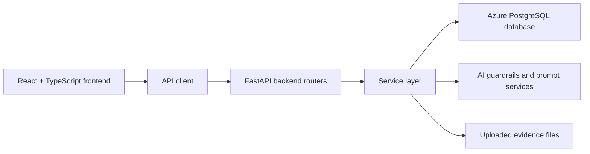
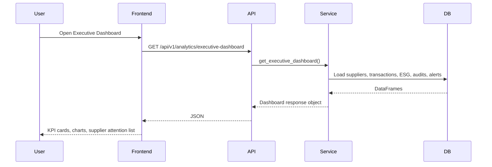
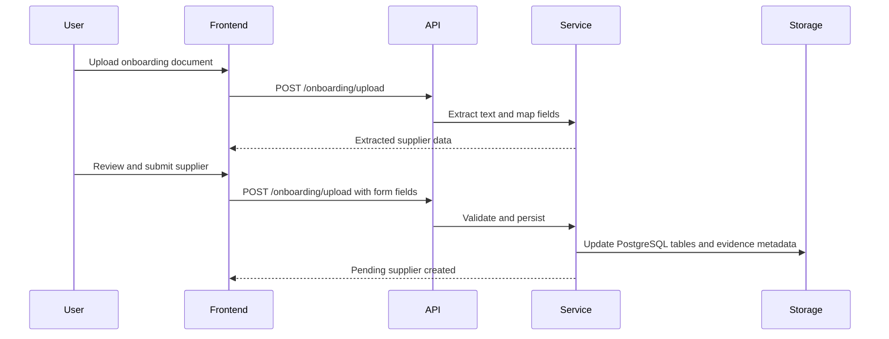
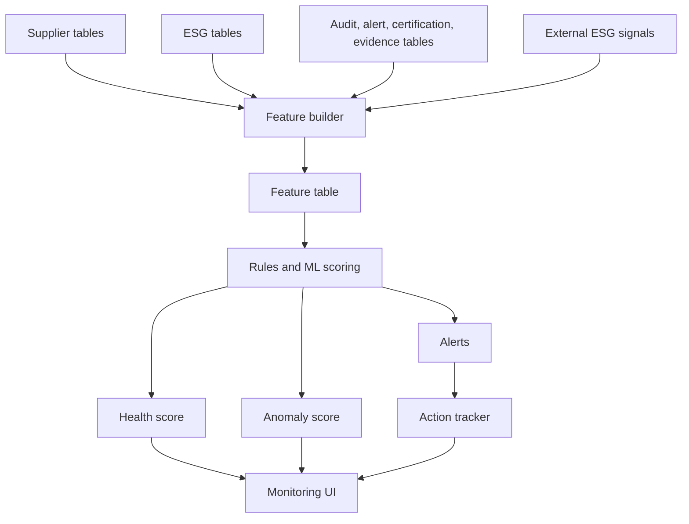

# Ozone AI 4.0 Technical Documentation

## 1. Technical Overview

Ozone AI 4.0 is implemented as a full-stack web application.

The main layers are:

- React frontend for the user interface.
- FastAPI backend for APIs and business logic.
- Azure PostgreSQL as the current persistence layer.
- Pandas-based services for data loading, joining, scoring, and summaries.
- AI service abstractions, prompt guardrails, and output validation for assistant-style workflows.



## 2. Frontend Technology Stack

The frontend is located in `frontend/`.

Important technologies:

| Technology | Usage |
| --- | --- |
| React 18 | Builds UI pages and components |
| TypeScript | Adds typed contracts for frontend APIs and components |
| Vite | Development server and production build tooling |
| React Router | Client-side routing between pages |
| TanStack React Query | API data fetching, loading state, caching, and mutations |
| Plotly / React Plotly | Advanced charts and visualizations |
| Recharts | Dashboard-style charts |
| React Simple Maps | Map visualizations |
| Tailwind CSS / CSS variables | Styling and layout |

Frontend scripts:

```bash
npm run dev
npm run build
npm run preview
```

## 3. Backend Technology Stack

The backend is located in `backend/app/`.

Important technologies from `requirements.txt`:

| Technology | Usage |
| --- | --- |
| FastAPI | REST API framework |
| Uvicorn | ASGI server for running FastAPI |
| Pydantic | Request and response schema validation |
| Pandas | Table loading, joining, grouping, and calculations |
| NumPy | Numerical processing support |
| scikit-learn | Machine learning and scoring utilities |
| OpenAI | AI assistant and generation integration |
| Google GenAI | Additional AI provider dependency |
| Azure AI Form Recognizer | Document extraction support |
| Azure Storage Blob | Evidence document storage for onboarding, audit, and traceability uploads |
| Azure Identity / Azure Core | Azure authentication and SDK support |
| python-dotenv | Local environment configuration |
| pytest | Testing support |

## 4. Application Architecture

### Frontend Layer

The frontend renders pages and calls backend APIs through typed API files in `frontend/src/api/`.

Important frontend files:

| File | Purpose |
| --- | --- |
| `frontend/src/App.tsx` | Defines routes |
| `frontend/src/components/layout/AppShell.tsx` | Shared header, navigation, floating Advisor AI button |
| `frontend/src/api/client.ts` | Shared API request helper |
| `frontend/src/api/analytics.ts` | Analytics and dashboard API functions |
| `frontend/src/api/simulator.ts` | Simulator API functions |
| `frontend/src/api/risk.ts` | Risk and due diligence API functions |
| `frontend/src/api/advisor.ts` | Advisor AI API functions |
| `frontend/src/api/esgMonitoring.ts` | ESG Monitoring API contract |
| `frontend/src/pages/SupplierEngagementPage.tsx` | Parent workspace for onboarding, auditing, traceability |

### Backend Layer

The FastAPI application is created in `backend/app/main.py`.

It registers:

- CORS middleware.
- Exception handlers.
- Health router.
- Dataset router.
- Auditing router.
- Analytics router.
- Advisor router.
- AI review router.
- ESG monitoring router.
- Risk router.
- Simulator router.
- Onboarding router.
- Traceability router.

### Data Layer

The current data store is Azure PostgreSQL, configured through `DATABASE_URL`.

The project previously used one CSV per dataset. Those CSVs have been migrated into PostgreSQL tables and removed from `data/`. A lightweight Pandas compatibility bridge maps legacy CSV path reads/writes to PostgreSQL tables while the service layer is gradually refactored toward direct table access.

## 5. Route Architecture

Frontend routes:

| Route | Component |
| --- | --- |
| `/executive-dashboard` | `ExecutiveDashboardPage` |
| `/simulator` | `SimulatorPage` |
| `/analytics` | `AnalyticsPage` |
| `/supplier-engagement` | `SupplierEngagementPage` |
| `/due-diligence-agent` | `DueDiligencePage` |
| `/advisor-ai` | `SupplierAdvisorAIPage` |

Redirect routes:

| Route | Redirects To |
| --- | --- |
| `/` | `/executive-dashboard` |
| `/onboarding` | `/supplier-engagement` |
| `/overview-dashboard` | `/executive-dashboard` |
| `/risk-monitoring` | `/analytics` |
| `/esg-monitoring` | `/analytics#analytics-esg` |
| `/due-diligence` | `/due-diligence-agent` |

## 6. Backend API Architecture

### Analytics APIs

Base route: `/api/v1/analytics`

Important endpoints:

- `GET /overview`
- `GET /executive-dashboard`
- `GET /country-distribution`
- `GET /country-analysis`
- `GET /commodity-analysis`
- `GET /supplier-rankings`
- `GET /certification-analysis`
- `GET /esg-pillar-analysis`
- `GET /trend-analysis`
- `GET /risk-distributions`
- `GET /esg-distribution`

Technical pattern:

1. Router receives HTTP request.
2. Service loads relevant PostgreSQL tables using Pandas.
3. Service joins supplier, ESG, certification, commodity, and transaction data.
4. Service calculates metrics.
5. Pydantic schema validates response.
6. Frontend renders charts and tables.

### Simulator APIs

Base route: `/api/v1/simulator`

Endpoints:

- `GET /options`
- `POST /run`

Technical pattern:

1. Frontend asks for available suppliers, countries, commodities, and scenario options.
2. User submits scenario.
3. Backend creates a before-and-after risk frame.
4. Service applies scenario-specific risk changes.
5. Service recomputes overall risk.
6. Response includes impact summary, changed suppliers, and deltas.

### Risk and Due Diligence APIs

Base route: `/api/v1/risk`

Endpoints:

- `GET /overview`
- `GET /distribution`
- `GET /segmentation`
- `GET /top-suppliers`
- `POST /due-diligence`

Technical pattern:

1. Build supplier risk frame.
2. Combine transaction metrics, audit metrics, alert metrics, certification metrics, commodity metrics, supplier metrics, ESG metrics, and country risk.
3. Score risk features.
4. Classify suppliers into risk levels.
5. For due diligence, generate supplier-specific drivers, evidence gaps, actions, and checklist.

### Onboarding APIs

Base route: `/onboarding`

Endpoints:

- `POST /upload`
- `POST /evidence/upload`
- `POST /decision`
- `POST /activate`
- `POST /revalidate`

Technical pattern:

1. Upload document or form data.
2. Extract text from document where applicable.
3. Map extracted text to supplier fields.
4. Validate fields.
5. Score ESG baseline.
6. Persist supplier, certification, evidence, ESG, traceability, and audit starter rows into PostgreSQL tables.
7. Use AI assistance where configured, with guardrails and fallback logic.

### Auditing APIs

Base route: `/auditing`

Endpoints:

- `GET /workspace`
- `POST /insights`
- `POST /decision`
- `POST /decision/apply`
- `POST /close`
- `POST /capa`
- `PATCH /capa`
- `POST /evidence/upload`
- `POST /certification-update`
- `POST /certification-extract`

Technical pattern:

1. Load audit workspace data from PostgreSQL.
2. Generate insights or decision recommendation.
3. Persist changes to audit, CAPA, certification, and evidence files.
4. Use document extraction where relevant.

### Traceability APIs

Base route: `/traceability`

Endpoints:

- `GET /workspace`
- `POST /gap-actions`
- `PATCH /gap-actions/{gap_id}`
- `POST /decision`
- `POST /evidence/review`
- `POST /evidence/upload`

Technical pattern:

1. Load suppliers, sites, lots, events, certifications, evidence, and gaps.
2. Build traceability score and EUDR readiness.
3. Manage gap action creation and updates.
4. Review uploaded evidence and apply effects to supplier traceability flags.
5. Persist decisions and score history.

### Advisor AI APIs

Base route: `/api/v1/advisor`

Endpoints:

- `POST /sessions`
- `GET /sessions/{session_id}`
- `POST /sessions/{session_id}/messages`

Technical pattern:

1. Create chat session.
2. Store or retrieve session messages.
3. User sends message with optional page lens and simulator context.
4. Backend builds grounded response using available context and AI guardrails.
5. Response is returned to frontend chat UI.

RAG behavior:

1. `AdvisorService` builds the deterministic Supplier 360 context from risk, analytics, ESG, traceability, audit, certification, and due diligence data where available.
2. If `RAG_ENABLED=true`, it calls `vector_search_service.search(...)` with the user's question.
3. Retrieved records are added to the prompt as `retrievedEvidence`.
4. The LLM is instructed to use the retrieved evidence only when it is relevant and to cite source titles.
5. The returned message includes a `sources` array so the frontend can display where the answer was grounded.

Example response fields:

```json
{
  "source": "llm",
  "provider": "gemini",
  "model": "gemini-3.1-flash-lite-preview",
  "trace_id": "ai_1234567890abcdef",
  "sources": [
    {
      "title": "Traceability Gap: 17 for supplier 1001",
      "sourceType": "traceability_gap",
      "sourceId": "17",
      "score": 0.82,
      "scoreType": "lexical"
    }
  ]
}
```

If RAG search fails for an infrastructure reason, Advisor AI continues with deterministic context. If the search query violates guardrails, the request is blocked instead of falling back silently.

### Knowledge / RAG APIs

Base route: `/api/v1/knowledge`

Endpoints:

- `POST /rebuild`
- `POST /search`

Technical pattern:

1. `POST /rebuild` calls `VectorSearchService.rebuild_index(...)`.
2. The service creates or upgrades the `knowledge_chunks` table.
3. It builds chunks from supported supplier intelligence tables.
4. Each chunk is sanitized before it is stored or embedded.
5. If embeddings are configured, the sanitized chunk text is embedded and stored in `embedding_json`.
6. `POST /search` validates the query through prompt guardrails before retrieval or embedding.
7. Search filters by `sourceType` and `supplierId` when those fields are supplied.
8. Results are ranked by lexical score by default, or by cosine similarity when query and chunk embeddings are available.

Supported indexed source types:

| Source Type | Backing Data | Example User Question |
| --- | --- | --- |
| `supplier` | Supplier profile plus risk enrichment | "Why is Supplier 1001 high risk?" |
| `audit` | Audit records | "Show audit blockers for the palm oil supplier." |
| `certification` | Supplier certification records | "Which certifications are expired or weak?" |
| `audit_capa` | CAPA actions | "What CAPA items are still open?" |
| `audit_evidence` | Audit evidence records | "What evidence supports this audit issue?" |
| `supplier_evidence` | Onboarding/certification evidence | "What uploaded evidence exists for this supplier?" |
| `traceability_gap` | Traceability gap actions | "Which traceability gaps block EUDR readiness?" |
| `traceability_decision` | Traceability decisions | "What was the latest trace decision?" |
| `due_diligence_case` | Due diligence cases | "Why was this supplier escalated?" |
| `monitoring_alert` | ESG monitoring alerts | "Which ESG alerts are open?" |
| `external_esg_signal` | External ESG signals | "What external signals affected ESG risk?" |

Example rebuild request:

```json
{
  "limit": 500
}
```

Example rebuild response:

```json
{
  "indexedChunks": 250,
  "embeddedChunks": 0,
  "embeddingProvider": "none",
  "embeddingModel": "text-embedding-3-small"
}
```

Example direct search request:

```json
{
  "query": "open CAPA traceability gaps for Indonesia suppliers",
  "topK": 5,
  "sourceType": "traceability_gap",
  "supplierId": 1001
}
```

Example direct search response:

```json
{
  "query": "open CAPA traceability gaps for Indonesia suppliers",
  "results": [
    {
      "chunkId": "traceability_gap_abc123",
      "sourceType": "traceability_gap",
      "sourceId": "17",
      "title": "Traceability Gap: 17 for supplier 1001",
      "text": "Gap Action Id: 17\nSupplier Id: 1001\nStatus: open",
      "metadata": {
        "supplier_id": 1001,
        "table": "traceability_gap_actions"
      },
      "score": 0.75,
      "scoreType": "lexical"
    }
  ]
}
```

Role requirements:

| Endpoint | Required Role | Why |
| --- | --- | --- |
| `POST /api/v1/knowledge/rebuild` | `model_admin` | Rebuilding controls what evidence enters AI retrieval. |
| `POST /api/v1/knowledge/search` | `ai_user` | Search exposes AI-grounding evidence to authorized AI users. |

Configuration:

| Variable | Meaning | Example |
| --- | --- | --- |
| `RAG_ENABLED` | Enables Advisor AI retrieval | `true` |
| `RAG_TOP_K` | Number of chunks Advisor AI retrieves | `5` |
| `RAG_EMBEDDING_PROVIDER` | `none`, `openai`, or `azure_openai` | `none` |
| `RAG_EMBEDDING_MODEL` | OpenAI embedding model name | `text-embedding-3-small` |
| `AZURE_OPENAI_EMBEDDING_DEPLOYMENT` | Azure OpenAI embedding deployment | `text-embedding-3-small-prod` |

### AI Review APIs

Base route: `/api/v1/ai-review`

Endpoints:

- `GET /queue`
- `POST /queue/{item_id}`

Technical pattern:

1. Retrieve pending or reviewed AI items.
2. User approves, rejects, or reviews AI item.
3. Decision is persisted through the review service or queue handling logic.

### ESG Monitoring API

Base route: `/api/v1/esg-monitoring`

Endpoint:

- `GET /overview`

Current technical status:

- Backend service exists.
- Frontend API contract exists.
- Frontend page has been removed.
- Executive Dashboard and Analytics consume the ESG Monitoring overview API.
- Current endpoint is an on-demand overview snapshot.

### Observability APIs

Base route: `/api/v1/observability`

Endpoints:

- `GET /ai-events`
- `GET /ai-events/stream`

Technical pattern:

1. AI gateway, guardrail, and knowledge-search code can call `emit_ai_event(...)`.
2. Events are stored in an in-memory deque with a maximum of 200 recent events.
3. `GET /ai-events?limit=50` returns recent events for reviewers or model administrators.
4. `GET /ai-events/stream` returns Server-Sent Events for live monitoring.
5. The stream emits a `connected` message first and heartbeat messages when no AI event arrives for 25 seconds.

Example event:

```json
{
  "event": "ai.guardrail_block",
  "timestamp": "2026-05-20T10:30:00+00:00",
  "feature": "knowledge_search",
  "reason": "prompt_injection",
  "layer": "input",
  "trace_id": "ai_1234567890abcdef"
}
```

Role requirements:

| Endpoint | Required Role | Why |
| --- | --- | --- |
| `GET /api/v1/observability/ai-events` | `reviewer` or `model_admin` | Reviewers need recent AI events; admins need operational visibility. |
| `GET /api/v1/observability/ai-events/stream` | `reviewer` | Live streams are intended for active AI review workflows. |

## 7. Data Model Overview

Important PostgreSQL tables:

| Table | Technical Role |
| --- | --- |
| `suppliers` | Main supplier master table |
| `transactions` | Transaction history and volume |
| `esg_environmental` | Environmental ESG indicators |
| `esg_social` | Social ESG indicators |
| `esg_governance` | Governance ESG indicators |
| `certifications` | Certification reference list |
| `supplier_certifications` | Supplier certification records |
| `commodities` | Commodity reference list |
| `supplier_commodity_map` | Supplier-to-commodity mappings |
| `audits` | Audit records |
| `audit_capa` | Corrective action records |
| `audit_evidence` | Audit evidence metadata |
| `alerts` | Supplier alert records |
| `supplier_evidence` | Supplier evidence metadata |
| `supplier_features` | Derived or model-ready supplier feature fields |
| `traceability_*` | Traceability sites, lots, events, gaps, decisions, score history |
| `monitoring_*` | Seed data for future monitoring |
| `external_esg_signals` | External ESG signal examples |
| `knowledge_chunks` | RAG index chunks used by Knowledge Search and Advisor AI |
| `ai_audit_events` | Persistent AI audit events, provider usage, guardrail outcomes, and trace ids |
| `ai_review_queue` | Human review workflow records for AI outputs that require approval or rejection |

## 8. Data Flow Example: Executive Dashboard



## 8A. Backend Calculation Reference

This section maps the main visible numbers in the application to the backend services that calculate them. It answers "where did this number come from?" for reviewers, developers, and demo presenters.

### Risk Score Calculation

Implemented in `backend/app/services/risk_service.py`.

The backend builds a supplier risk frame by joining supplier master data with transaction, audit, alert, certification, commodity, country, and ESG metrics. Most raw values are converted to a 0-100 relative risk score using percentile ranking:

```text
relative risk score = percentile rank across suppliers * 100
```

If a metric is better when higher, such as verified certification ratio or wage maturity, the score is inverted:

```text
relative risk score = 100 - percentile rank
```

Operational risk is a weighted score across delivery, defect, cost, dependency, criticality, audit, alert, certification, commodity, and country risk. ESG risk is:

```text
ESG risk = 0.40 * environmental risk + 0.35 * social risk + 0.25 * governance risk
```

Overall risk combines operational and ESG risk with pressure adjustments:

```text
dual pressure = ((operational risk + ESG risk) / 2) * 0.05
imbalance pressure = (abs(operational risk - ESG risk) / 100) * max(operational risk, ESG risk) * 0.30

overall risk = 0.58 * operational risk + 0.37 * ESG risk + dual pressure + imbalance pressure
```

Risk levels:

| Score Range | Risk Level |
| --- | --- |
| `>= 60` | High |
| `>= 40 and < 60` | Medium |
| `< 40` | Low |

Example:

```text
Operational risk = 70
ESG risk = 55
Dual pressure = 3.13
Imbalance pressure = 3.15
Overall risk = 67.23
Risk level = High
```

### Executive Dashboard And Analytics Calculations

Implemented in `backend/app/services/analytics_service.py`.

| Visible Value | Backend Calculation |
| --- | --- |
| Total suppliers | Count supplier master rows |
| High-risk suppliers | Count suppliers where `overall_risk_level == "High"` |
| Average overall/operational/ESG risk | Mean of the matching score column |
| Risk mix | Count High, Medium, and Low risk levels |
| Expiring soon certifications | Expiry date from `2026-04-28` through `2026-06-26` |
| Expired certifications | Expiry date on or before `2026-04-27` |
| Geographic exposure | Group by country; count suppliers and average risk |
| Commodity exposure | Join supplier-commodity map; group by commodity; count unique suppliers |
| Country analysis | Group filtered risk frame by country and average risk columns |
| Commodity analysis | Group supplier-commodity/risk join by commodity and average risk/volume |
| Supplier rankings | Sort by overall, operational, ESG, or lowest risk |
| Risk distributions | Build score histograms with `pd.cut` |
| Trend analysis | Group transactions and certification dates by month |

Health bands:

| Average Risk | Label |
| --- | --- |
| `>= 60` | At Risk |
| `>= 40 and < 60` | Watch |
| `< 40` | Stable |

### Simulator Calculations

Implemented in `backend/app/services/simulator_service.py`.

The simulator starts with the same risk frame used by Analytics and Due Diligence. A scenario adds risk to affected suppliers and then recomputes overall risk.

```text
new operational risk = min(100, old operational risk + scenario operational impact)
new ESG risk = min(100, old ESG risk + scenario ESG impact)
new overall risk = 0.58 * new operational risk + 0.37 * new ESG risk + dual pressure + imbalance pressure
delta = after value - before value
```

The response includes before summary, after summary, deltas, risk band movement, and affected suppliers sorted by largest overall-risk increase.

### Due Diligence Calculations

Implemented in `backend/app/services/risk_service.py`.

The Due Diligence Agent uses the supplier risk frame plus certification, commodity, audit, CAPA, traceability gap, and traceability decision signals.

| Condition | Decision |
| --- | --- |
| Overall risk `>= 75` | Block / Suspend |
| Overall risk `>= 65`, any open CAPA, or more than one open trace gap | Escalate |
| Overall risk `>= 55`, expired certification, or any open trace gap | Enhanced Monitoring |
| Pending certification | Clear with Conditions |
| No major blocker | Clear |

Risk drivers shown to the user include operational risk, ESG risk, high-risk commodities, open CAPA count, and open trace gap count.

### Traceability Score Calculation

Implemented in `backend/app/services/traceability_service.py`.

Traceability starts at 100 and subtracts penalties:

```text
- 5 for each high-risk commodity
- 8 for each certification gap
- 10 for each event missing evidence
- 6 for each lot with gap/missing/partial evidence
- 8 for each missing geolocation or polygon evidence item
- severity penalty for each open gap action
- 12 if no lots exist
- 10 if no sites exist
```

Gap severity penalties are Critical 18, High 12, Medium 7, and Low/unknown 4.

Score labels are Strong for `>= 80`, Moderate for `>= 60`, Gap for `>= 40`, and High Risk below 40.

### ESG Monitoring Calculations

Implemented in `backend/app/services/esg_monitoring_service.py`.

Important formulas:

```text
BWS risk = 0.70 * water risk + 0.30 * country risk
HRR risk = 0.42 * labor risk + 0.24 * child risk + 0.18 * hours risk + 0.16 * inverted wage score
Land-use risk = 0.34 * land risk + 0.34 * deforestation risk + 0.32 * commodity land pressure
ESG health score = 100 - ESG risk score
```

ML anomaly scoring uses `IsolationForest(contamination=0.18, random_state=42)`. Raw anomaly scores are normalized to 0-100:

```text
normalized anomaly score = ((raw score - min raw score) / (max raw score - min raw score)) * 100
```

Anomaly labels are `Anomalous ESG deterioration pattern` at 75 or higher, `Elevated ESG anomaly watch` at 55 or higher, and `No ML anomaly detected` below 55.

### RAG Search Score Calculation

Implemented in `backend/app/services/vector_search_service.py`.

Lexical search tokenizes query and chunk text, removes common stop words, and scores overlap:

```text
lexical score = matched query terms / unique query terms
```

If the exact query phrase appears in the title or text, the backend adds a `0.15` phrase bonus. Vector mode uses cosine similarity between query and chunk embeddings. The response field `scoreType` shows whether ranking used `lexical` or `vector`.

## 9. Data Flow Example: Onboarding



## 10. Feature-to-Technology Mapping

| Feature | Frontend | Backend | Data / Processing |
| --- | --- | --- | --- |
| Executive Dashboard | React, React Query, charts | Analytics router/service | Pandas aggregation across supplier data |
| Analytics | React, Plotly, Recharts, maps | Analytics APIs | Country, commodity, ESG, certification, trend calculations |
| Simulator | React forms and scenario UI | Simulator service | Risk frame recomputation in Pandas |
| Onboarding | Upload UI, form workflow | Onboarding router/service | Document extraction, validation, PostgreSQL persistence |
| Auditing | Workspace UI | Auditing router/service | Audit, CAPA, certification, evidence data |
| Traceability | Workspace UI | Traceability router/service | Sites, lots, events, evidence, score calculations |
| Due Diligence | Supplier investigation UI | Risk service | Risk driver and evidence gap generation |
| Advisor AI | Chat page and overlay | Advisor router/service | AI context, guardrails, session messages |
| Knowledge Search / RAG | Advisor grounding and direct API search | Knowledge router/vector search service | `knowledge_chunks`, supplier evidence, audit, traceability, due diligence, monitoring records |
| AI Review | Queue page component | AI review router | Human review of AI items |
| AI Observability | Backend API and SSE stream | Observability router/live flow service | In-memory recent AI events plus persistent audit log where available |
| ESG Monitoring | Embedded in Executive Dashboard and Analytics | ESG monitoring router/service | Internal supplier ESG data, calculated overview, alerts, and ML anomaly scoring |

## 11. AI Architecture

The AI-related code is structured around:

- Prompt registry.
- Guardrails.
- Output validation.
- Deterministic fallback behavior.
- Review queue support.

Important files:

| File | Purpose |
| --- | --- |
| `backend/app/ai/guardrails.py` | Blocks unsafe or unsupported AI requests |
| `backend/app/ai/prompt_registry.py` | Stores prompt policy and feature prompt definitions |
| `backend/app/ai/output_validation.py` | Validates AI-generated structured outputs |
| `backend/app/services/vector_search_service.py` | Builds and searches the RAG knowledge index |
| `backend/app/routers/knowledge.py` | Exposes knowledge rebuild and search APIs |
| `backend/app/observability/live_flow.py` | Keeps recent AI events and streams them over SSE |
| `backend/app/services/ai_audit_log.py` | Persists AI audit events for review and traceability |
| `data/ai_audit_events.jsonl` | Stores AI audit trail examples |

Important design principle:

AI is advisory. It should not create final procurement, legal, compliance, or audit decisions without human review.

## 12. Current ESG Monitoring Technical Status

### Frontend

Files:

- `frontend/src/api/esgMonitoring.ts`
- `frontend/src/features/esg-monitoring/hooks/useEsgMonitoring.ts`
- `frontend/src/features/executive-dashboard/pages/ExecutiveDashboardPage.tsx`
- `frontend/src/pages/AnalyticsPage.tsx`

Current implementation:

- There is no standalone `EsgMonitoringPage`.
- `/esg-monitoring` redirects to the ESG section inside Analytics.
- Executive Dashboard calls the ESG Monitoring overview API to render a leadership snapshot.
- Analytics calls the ESG Monitoring overview API to render the supplier monitoring queue, alert summary, and ML monitoring context.
- Numeric values shown to users are rounded to two decimals where decimals are displayed.

### Frontend API Contract

The frontend contract defines TypeScript interfaces for:

- `GET /api/v1/esg-monitoring/overview`
- `EsgMonitoringKpi`
- `EsgIndicatorSummary`
- `EsgWatchlistSupplier`
- `EsgAlertItem`
- `EsgHealthTrend`
- `EsgMlInsights`

### Backend

Files:

- `backend/app/routers/esg_monitoring.py`
- `backend/app/services/esg_monitoring_service.py`
- `backend/app/schemas/esg_monitoring.py`

The backend has logic for:

- Monitoring overview.
- Monitoring KPIs.
- ESG indicator summaries.
- Supplier watchlist.
- Alert items.
- ML-style anomaly insights.

The current backend returns an on-demand overview snapshot. It does not yet run scheduled public API ingestion jobs.

## 13. ESG Monitoring Technical Design

This section maps the embedded ML Continuous ESG Monitoring views and the public API extension path.

### 13.1 Embedded Monitoring Surfaces

Implemented technical behavior:

- Executive Dashboard calls `useEsgMonitoringOverview` and renders open alerts, deteriorating suppliers, average ESG health, the first supplier to review, and the highest open alert.
- Analytics calls `useEsgMonitoringOverview` and renders the ESG Monitoring Queue inside the ESG section.
- The old route remains as a redirect for compatibility, but the navigation no longer exposes ESG Monitoring as a standalone page.

### 13.2 Supplier ESG Health Score

Technical implementation:

- Combine environmental, social, and governance risk fields.
- Normalize scores to 0 to 100.
- Invert risk where needed so higher health means better condition.
- Return `esgHealthScore` for watchlist suppliers and `averageEsgHealth` for the KPI strip.
- Store monthly score snapshots in a future table when historical monitoring is added.

Example formula:

```text
ESG health = 100 - weighted ESG risk
weighted ESG risk = environmental * 0.4 + social * 0.35 + governance * 0.25
```

Recommended future data store:

- `supplier_esg_monthly_snapshots`

### 13.3 ML Anomaly Detection

Technical implementation:

- Use scikit-learn IsolationForest when model dependencies and sufficient rows are available.
- Use deterministic fallback scoring when ML fitting is not possible.
- Input features can include ESG risk, alerts, certification gaps, audit non-compliance, evidence age, country risk, commodity risk, and transaction dependency.
- Return `averageAnomalyScore`, `flaggedSuppliers`, top model signals, and flagged supplier details.

Example features:

| Feature | Meaning |
| --- | --- |
| `environmental_risk_score` | Environmental supplier risk |
| `social_risk_score` | Social supplier risk |
| `governance_risk_score` | Governance supplier risk |
| `open_alert_count` | Number of open supplier alerts |
| `evidence_age_days` | Age of latest evidence |
| `expired_certification_count` | Number of expired certifications |
| `audit_non_compliance_count` | Audit issues |
| `country_risk_score` | Country-level risk |
| `commodity_pressure_score` | Commodity-level risk |

Output:

- `ml_anomaly_score`
- `ml_signal_label`
- `top_anomaly_drivers`
- `ml_confidence`

### 13.4 Trend Monitoring

Technical implementation:

- Current overview returns aggregate `healthTrends`.
- Persist monthly snapshots.
- Calculate rolling averages.
- Compare latest score vs previous month or quarter.
- Generate trend labels.

Example labels:

- `Improving`
- `Stable`
- `Deteriorating`
- `New critical signal`

Technical endpoints:

- `GET /api/v1/esg-monitoring/trends`
- `GET /api/v1/esg-monitoring/suppliers/{supplier_id}/history`

These are recommended future endpoints. The current UI uses `GET /overview`.

### 13.5 Alert Stream and Alert Lifecycle

Technical implementation:

- Current overview returns open ESG alert items.
- Add alert status update endpoint.
- Add alert assignment, due date, and notes.

Suggested endpoints:

- `GET /api/v1/esg-monitoring/alerts`
- `PATCH /api/v1/esg-monitoring/alerts/{alert_id}`
- `POST /api/v1/esg-monitoring/alerts/{alert_id}/notes`

Suggested fields:

- `alert_id`
- `supplier_id`
- `indicator`
- `severity`
- `status`
- `owner`
- `due_date`
- `created_at`
- `resolved_at`
- `linked_action_id`

### 13.6 Monitoring Actions

Technical implementation:

- Current overview returns recommended actions attached to alerts and watchlist suppliers.
- Add create/update endpoints.
- Link actions to alerts and suppliers.

Suggested endpoints:

- `POST /api/v1/esg-monitoring/actions`
- `PATCH /api/v1/esg-monitoring/actions/{action_id}`
- `GET /api/v1/esg-monitoring/actions?status=open`

### 13.7 Evidence Refresh Monitoring

Evidence refresh is a recommended extension. It should track stale or missing supplier evidence.

Technical implementation:

- Use `supplier_evidence_v2.csv`.
- Use `supplier_evidence_refresh_v2.csv`.
- Calculate evidence age.
- Derive status:
  - `Current`
  - `Due soon`
  - `Expired`
  - `Missing`

Possible endpoint:

- `GET /api/v1/esg-monitoring/evidence-refresh`

### 13.8 External ESG Signal Ingestion

Public API and external ESG ingestion is a recommended extension. It should include ESG signals from outside the internal data files.

Technical implementation:

Prototype:

- Use `external_esg_signals_v2.csv`.
- Treat each row as signal input.

Production:

- Scheduled ingestion jobs.
- External APIs or file drops.
- Deduplication and entity matching.
- Signal severity classification.
- Source freshness and confidence scoring.
- Supplier linkage by supplier name, country, commodity, region, and site location where available.

Possible components:

- Signal ingestion service.
- Supplier/entity matching service.
- Alert generation service.
- Signal audit log.

Recommended public API categories:

| Category | Example Technical Source Type | Matching Key |
| --- | --- | --- |
| Climate and disaster | Public hazard or disaster feeds | Supplier country, region, site |
| Deforestation and land use | Forest-loss or protected-area feeds | Commodity, country, coordinates |
| News and incidents | Public news/event APIs | Supplier name, country, commodity |
| Macro ESG indicators | Public country ESG datasets | Country |
| Pollution and environment | Air/water/environmental quality feeds | Region or site coordinates |

Suggested normalized table:

```text
external_esg_signals
- signal_id
- source_name
- source_url
- source_category
- observed_at
- ingested_at
- country
- region
- commodity
- supplier_name_match
- latitude
- longitude
- severity
- confidence
- signal_title
- signal_summary
- raw_payload_ref
```

### 13.9 Monthly Snapshot Builder

Functional goal:

Persist supplier ESG state over time.

Technical implementation:

- Create a scheduled job that runs monthly.
- Load current supplier/ESG/evidence/audit/certification data.
- Calculate monitoring features.
- Save snapshot records.

Suggested future table:

```text
supplier_esg_monitoring_snapshots
- snapshot_id
- supplier_id
- snapshot_month
- environmental_risk
- social_risk
- governance_risk
- esg_health_score
- anomaly_score
- open_alert_count
- stale_evidence_count
- certification_gap_count
- trend_label
```

### 13.10 ML Monitoring Pipeline Diagram



## 14. Suggested Future Database Design

The current CSV approach is fine for prototype work. For production, recommended storage would include:

| Area | Recommended Store |
| --- | --- |
| Supplier master data | Relational database |
| Transactions | Database or data warehouse |
| Evidence files | Azure Blob Storage, with local upload fallback for development |
| Evidence metadata | Relational database |
| ESG snapshots | Time-series table or warehouse table |
| External signals | Event store or normalized signal table |
| AI audit logs | Append-only log table |
| Monitoring alerts/actions | Relational workflow tables |

## 15. Non-Functional Considerations

### Security

- Add authentication and role-based access.
- Restrict who can approve suppliers, close audits, and resolve alerts.
- Protect uploaded evidence files.
- Audit all AI-assisted decisions.

### Data Quality

- Validate CSV or database inputs.
- Track missing supplier IDs.
- Standardize country and commodity names.
- Prevent duplicate supplier records.

### Reliability

- Add automated tests for scoring services.
- Add API contract tests.
- Add retry logic for external AI or document extraction services.

### Scalability

- Harden PostgreSQL schema, indexes, and deployment migration practices.
- Cache dashboard aggregations.
- Use background jobs for snapshot generation.
- Use event-driven ingestion for external ESG signals.

### Explainability

- Every score should show drivers.
- Every AI recommendation should list evidence used.
- Every alert should explain why it was generated.

## 16. Build and Verification

Frontend build command:

```bash
cd frontend
npm run build
```

Known build note:

- The build currently completes successfully.
- Vite reports a large chunk warning because the generated JavaScript bundle is over 500 kB.
- This is a performance warning, not a build failure.

Possible future improvement:

- Add route-based code splitting.
- Move heavy chart libraries into lazy-loaded chunks.

## 17. Current Technical Summary

Implemented:

- React app shell and routing.
- Executive dashboard.
- Analytics.
- Simulator.
- Supplier Engagement workspace.
- Onboarding.
- Auditing.
- Traceability.
- Due Diligence Agent.
- ESG Monitoring embedded in Executive Dashboard and Analytics.
- Backend ESG monitoring API.
- ESG monitoring schemas.
- ESG monitoring service logic.
- Supplier Advisor AI.
- AI review backend and page component.
- FastAPI backend with routers and service layer.
- PostgreSQL-backed persistence.
- AI guardrails and validation.

Available for future ESG Monitoring expansion:

- Scheduled external public API ingestion.
- ESG signal event store.
- Monthly supplier ESG snapshots.
- Alert lifecycle update APIs.
- Monitoring action workflow APIs.
